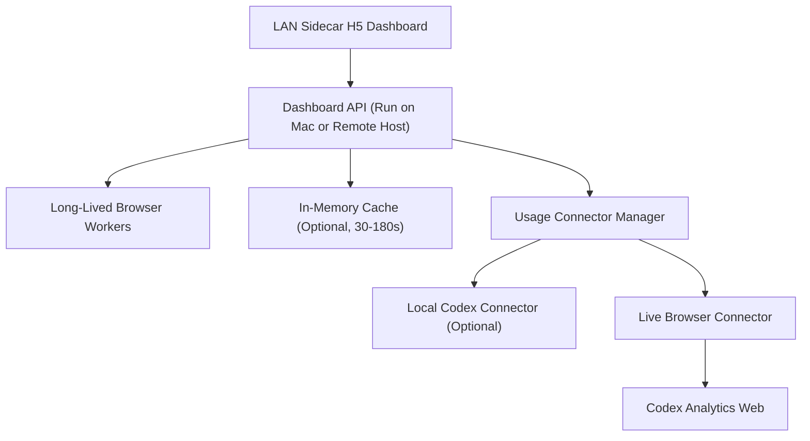

# Token BI 解决方案

补充文档：

- [SETUP.md](/Users/gbs00/我的文件夹/Projects/Token_BI/SETUP.md)：新电脑部署、日常启动、账号登录、副屏设备访问与排障说明
- [TECH_ARCHITECTURE.md](/Users/gbs00/我的文件夹/Projects/Token_BI/TECH_ARCHITECTURE.md)：后续开发使用的技术架构文档
- [CHANGELOG.md](/Users/gbs00/我的文件夹/Projects/Token_BI/CHANGELOG.md)：版本记录与关键决策演进

## 2026-04-26 v0.9.1 跨设备看板与控制台体验修复

今天已围绕真实 Mac App + 副屏设备验收完成一轮体验修复：

- 控制台按最新设计稿整理为更像桌面 App 的管理页，合并服务开关为 `开启服务` / `关闭服务` 单按钮。
- 首次启动引导在全部完成后会自动收缩为通栏小卡片，`查看引导` 按钮固定在右侧；点击后可重新展开完整步骤。
- `扫码连接副屏` 不再常驻展示二维码，改为点击后弹窗显示，支持通过右上角 `x` 关闭。
- BI 看板取消账号下拉框，仅直显当前脱敏账号，降低副屏上不必要的交互复杂度。
- BI 看板的 `同步额度` 等价于手动刷新 usage，会直接触发后端读取最新 Codex analytics usage。
- 额度百分比继续按 4 档剩余量显示不同颜色，并同步作用于数字和进度条。
- 针对 iPhone 5s / iOS Safari 增加旧浏览器 fallback，确保百分比数字足够突出，并让 `%` 与 `left` 之间保留清晰间距。
- 修复控制台启动主服务时端口误判、启动失败后 PID/runtime 残留，以及 Chrome profile 路径包含空格时 worker 复用失败的问题。

## 2026-04-25 v0.9 可信测试版补充

今天已围绕“新测试用户能顺利启动、登录、恢复和连接副屏”完成一轮体验增强：

- 控制台账号入口已收敛为一个按钮：无账号或未登录时显示 `登录账号`，usage 可读取后显示 `退出账号`。
- `退出账号` 会删除 Token BI 专用账号记录和 Chrome profile，不影响用户日常 Chrome，也不会删除 usage 历史，因为项目本身不存储 usage 历史。
- 主服务默认仍优先使用 `8787`；如果端口被占用，会自动 fallback 到 `8788-8877` 中的可用端口。
- 控制台入口、二维码、`.local` 固定入口、局域网 IP 入口和本机入口会同步展示实际端口，避免用户记错地址。
- 成功刷新 usage 后，Token BI 会尝试自动最小化自己管理的 Chrome worker，减少登录窗口长期停留在桌面的打扰。
- 控制台新增首次启动 checklist，帮助新用户按“检测 Chrome → 启动服务 → 登录账号 → 刷新 usage → 扫码连接副屏”的顺序完成设置。
- 控制台新增可执行异常提示，强调“发生了什么”和“下一步怎么做”，降低新用户卡住时的排障成本。
- 本轮仍不做公开分发能力：Developer ID 签名、公证、Universal DMG 和正式自动更新留到后续版本。

## 2026-04-23 当前版本补充

今天已将 MVP 从“命令行手动启动 + IP 地址访问”进一步收敛为更适合日常使用的 Mac 副屏产品形态：

- Mac App 原型：新增 `Token BI.app`，用户可双击 App 打开内嵌控制台，不再需要记住 `127.0.0.1:8790` 或手动执行脚本。
- App 生命周期：`Token BI.app` 是本项目的总开关；关闭 App 时会停止控制台、停止 `8787` 主服务，并关闭 Token BI 管理的 Chrome worker，避免后台长期占用。
- App 视觉：已按设计稿重绘 App icon，并将控制台升级为桌面 App 风格页面，包含状态卡、按钮组、入口列表、运行日志和底部状态栏。
- 固定入口：副屏设备优先使用 `http://gbs00MacBook-Air-M2.local:8787/dashboard`，不再依赖会变化的局域网 IP。
- 扫码自联：控制台新增 `扫码连接副屏`，可直接展示固定 `.local` 看板二维码，并提供局域网 IP 备用二维码。
- 本地控制台：Mac 端可在 App 内直接管理控制页面，也可通过 `scripts/open_control_panel.command` 作为备用入口打开控制页。
- 服务生命周期：Token BI 主服务启动时会尝试为 `active` 账号恢复或拉起对应浏览器 worker；App 退出时会释放本项目运行资源。
- 副屏刷新策略：看板页面不再使用整页 `reload`，改为后台请求 `/api/v1/dashboard` 并原地更新额度。服务短暂重启时页面会保留旧内容并自动重试。
- 主屏幕/桌面快捷方式：页面支持 iPhone Safari “添加到主屏幕”和 Android Chrome “添加到主屏幕”等浏览器入口，横屏长期摆放时建议使用该类独立入口。
- 浏览器边界：网页无法强制控制不同设备浏览器的上下栏；是否全屏由具体系统、浏览器和启动方式决定。
- 额度强调：`remaining_pct` 数字已放大，并按剩余量分为 4 个颜色档位：`>75%`、`>50 且 <=75%`、`>25 且 <=50%`、`<=25%`。
- 分发边界：当前 App 仍是项目目录型原型，可生成 `.dmg` 作为开发预览版；若要给普通用户开箱即用，还需将 Python 后端、脚本和运行数据迁入自包含 App 结构。

## 2026-04-24 产品化基础补充

今天已完成面向独立 Mac App 分发的第一轮底层改造：

- Python 后端已打包为 `token-bi-backend` sidecar，Tauri App 不再依赖项目目录脚本启动控制台。
- 用户数据目录切换到 `~/Library/Application Support/Token BI/`，用于保存账号元信息、浏览器登录态、缓存和日志。
- 新增从项目目录到 App Support 的迁移模块，为后续从开发版升级到正式 App 做准备。
- `npm run app:build` 现在会先构建 sidecar，再生成 `.app` 与 `.dmg`。
- 新增 `scripts/release_local.sh` 与 [docs/RELEASE.md](/Users/gbs00/我的文件夹/Projects/Token_BI/docs/RELEASE.md)，用于本地 release 检查和未来 GitHub Releases 发布。
- 当前 DMG 仍是 unsigned local build；给更多用户使用前需要 Developer ID 签名、notarization 和正式 updater manifest。

## 2026-04-25 本地安装验收补充

今天已完成 `Token BI.app` 的本地安装与副屏连接验收：

- 已通过 DMG 将 `Token BI.app` 安装到 Mac 本地，并验证可从 App 入口进入控制台。
- 已验证 App 控制台可启动 Token BI 主服务，并让副屏设备通过局域网入口访问看板。
- 项目源码统一保留在 `/Users/gbs00/我的文件夹/Projects/Token_BI`。
- `.config/superpowers/worktrees/Token_BI` 仅作为开发临时 worktree，合并推送后应清理，避免和真实项目目录混淆。
- 当前版本适合作为本人本机验收版本；公开分发前仍需完成签名、公证、更新 manifest 和干净机器安装测试。

## 1. 项目目标

建设一个面向 `任意同局域网副屏设备` 的轻量级 Web 看板，用于实时查看当前 `Codex` 订阅账号的额度情况，并为后续多账号管理保留基础能力。

核心要求：

- 终端设备：任意可访问同一局域网的浏览器设备，如 `iPhone`、`Android 手机`、`小米手机`、`iPad/Android 平板`、旧手机、旧电脑、部分电子墨水屏等
- 展示形态：局域网 Web 看板，支持添加到主屏幕或浏览器快捷入口
- 使用定位：这些设备作为 `Mac` 的 Codex 额度副屏看板
- 刷新频率：每 `3 分钟`
- 首期重点：`Codex 订阅账号`
- 首期访问范围：仅支持 `同一 WiFi / 同一局域网`
- 多账号能力：后端保留多个 `Codex` 订阅账号的独立额度查看基础；当前副屏看板优先直显当前账号，不在小屏上提供下拉切换
- 视觉基准：首个重点适配设备仍为 `iPhone 5s 横屏`，后续扩展到更多屏幕尺寸

## 2. 输入模块梳理

基于幕布文档 [token bi](https://share.mubu.com/doc/3DGaWroDAp-) ，当前显示模块可归纳为：

1. `agents 切换栏（预留）`
2. `Codex 当前账号脱敏信息栏`
3. `Codex 账号Usage统计`
4. `Usage 详情入口（外链跳转）`
5. `最近3条活跃session名称（建议不纳入 MVP）`

建议将上述模块正式定义为以下信息架构：

### 2.1 一级导航

- `Codex`

说明：

- `Codex` 为首期唯一页面
- 其他 agent 扩展能力不进入当前 MVP

### 2.2 当前账号展示

- 当前版本不在副屏看板上展示账号下拉或横向账号列表
- 控制台负责登录 / 退出当前账号
- 看板直接展示当前账号脱敏邮箱

### 2.3 主内容区

- 当前账号信息卡
- `5 小时额度`与 `剩余重置时间`
- `周额度`与 `剩余重置时间`
- `Usage 详情入口`

## 3. 核心产品判断

## 3.1 最稳妥的技术路线

`Mac 端实时采集 + 局域网副屏轻量 H5 看板`


## 3.2 对“token 统计”的定义要收敛

展示口径聚焦为：

1. `订阅额度口径`
   - `5 小时额度`
   - `周额度`
   - `剩余百分比`
   - `下次重置时间`

前端应在界面上明确标记数据来源：

- `Scraped`
- `Estimated`

## 3.3 MVP 取舍建议

建议首期只突出“当前最关键状态”，不做历史分析能力。

MVP 保留：

- 当前账号直显
- `5 小时额度`
- `周额度`
- `剩余百分比`
- `下次重置时间`
- `最近更新时间`
- `Usage 详情入口`

MVP 不做：

- `7 日用量柱状图`
- `7 日 skills 用量统计`
- `最近 3 条活跃 session 名称`
- 任意 usage 历史落库

## 3.4 设备关系定义

本项目中，副屏设备的角色应定义为：

`Mac 上 Codex 账号额度的副屏看板`

这意味着：

- 副屏展示的不是“Mac 屏幕截图”
- 副屏设备读取的也不是本机额度
- 副屏设备看到的是 `Mac` 侧服务实时拉取到的同一账号额度数据

因此，本方案关注的是“账号级额度”，不是“Mac 本机某个进程的内部瞬时状态”。

如果目标是展示：

- `5 小时额度`
- `周额度`
- `重置时间`

那么任意同局域网副屏设备都可以准确展示，只要它读取的是 `Mac` 侧服务产出的同一账号数据。

## 3.5 同 WiFi 准确展示的前提

副屏设备与 `Mac` 处于同一 WiFi / 同一局域网下，可以不通过数据线直接访问看板，但需要满足以下前提：

- `Mac` 上运行一个本地服务，负责读取 Codex 当前账号额度
- 该服务监听的是局域网可访问地址，而不是仅 `127.0.0.1`
- 副屏设备通过浏览器访问 `Mac` 的局域网地址或本地域名
- `Mac` 防火墙允许该端口访问
- 路由器没有开启客户端隔离
- `Mac` 在看板使用期间保持在线且不休眠

要特别说明：

- “同一 WiFi” 只代表副屏设备可以访问 `Mac`
- 不代表副屏设备会自动知道 `Mac` 上的 Codex 额度
- 真正让数据准确的前提，是 `Mac` 侧服务拿到的就是你正在使用的那个 Codex 账号数据

## 3.6 准确性验收标准

首期建议把“准确展示”定义为：

- 副屏设备展示的是 `Codex 账号级当前额度`
- 允许 `0-3 分钟` 的刷新延迟
- 不承诺任务级、秒级、进程级实时状态
- 当采集失败时，允许展示“上次成功结果 + 过期标记”

## 4. 无历史存储原则

本方案中的“不存储数据”，建议明确定义为：

- 不存储 usage 历史快照
- 不存储 7 日趋势数据
- 不做 skills 历史统计
- 不保存分析报表

但以下最小信息仍需要保留，否则无法实现多账号切换：

- 账号别名
- 最小鉴权配置
- 加密后的 API Key 或登录态 session

如果连这些都不持久化保存，那么服务重启后需要重新逐个账号登录，MVP 可用性会明显下降。


## 5. 推荐系统架构



### 5.1 架构分层

#### A. 副屏展示层

职责：

- 渲染单账号和多账号看板
- 当前版本直显当前 Codex 账号，后续再恢复多账号切换控件
- 展示最近刷新时间
- 自动轮询刷新
- 作为 `Mac` 的副屏展示终端

建议：

- `SSR + 少量原生 JavaScript`
- 避免重前端框架依赖
- 首期优先兼容 `Safari iOS 12`
- 同时适配 Android Chrome / 小米浏览器 / 平板浏览器等常见移动浏览器

#### B. Dashboard API 层

职责：

- 向副屏页面输出极简 JSON
- 做账户鉴权
- 聚合实时读取到的当前指标
- 屏蔽底层采集差异
- 提供详情页跳转链接

建议技术：

- `FastAPI`
- 或 `Node.js + Express/NestJS`

默认部署建议：

- MVP 默认部署在 `Mac` 本机
- 副屏设备通过局域网访问该服务
- 不需要数据线连接
- 访问形式可为 `http://<mac-lan-ip>:<port>` 或本地域名
- 推荐启动方式为 `Token BI.app`
- 脚本启动保留为备用方式
- 只要用户不主动关闭服务，服务就持续运行

#### C. Long-Lived Browser Workers

职责：

- 为每个账号维护一个长驻浏览器会话
- 由用户在该会话中手动登录 `Codex`
- 保持浏览器窗口和上下文存活，供后台定时读取 usage
- 不依赖“浏览器关闭后仍可复用 cookie”作为主前提

建议：

- 采用 `Playwright persistent context + headful browser`
- 一个账号一个独立 context 和独立窗口
- 服务运行期间不主动关闭该 worker
- 服务重启后允许重新登录，不把“跨重启复用登录态”视为 MVP 必须能力

#### D. In-Memory Cache

职责：

- 为最近一次读取结果提供 `30-180 秒` 短时缓存
- 避免同一时刻重复抓取
- 服务重启后可直接丢失，不做持久化

建议：

- 可选，不是必需
- 可以直接使用进程内缓存
- 只保留内存态结果，不跨重启持久化

#### E. 实时连接器层

职责：

- 实时读取 `Codex` 订阅账号当前额度数据
- 统一调度多个 usage connector
- 只读取当前看板需要的字段，不做全量抓取

## 6. 数据源策略

参考 `CodexBar` 的启发，MVP 不应把“网页抓取”写死为唯一数据源，而应采用：

`Usage Connector Manager + 多源 fallback`

建议固定顺序为：

1. `Local Codex Connector`
2. `Web Session Connector`
3. `Web DOM fallback`

其中：

- `Local Codex Connector` 是增强型入口，用于未来接入本机 Codex/CLI 侧快照
- `Web Session Connector` 是当前 MVP 的主路径
- `Web DOM fallback` 是 `Web Session Connector` 内部的最后一级降级，而不是独立主连接器

### 6.1 Local Codex Connector

适用对象：

- 未来需要接入本机 Codex/CLI usage 快照的场景

来源：

- 读取本机标准化 usage snapshot
- 如果当前账号没有本地 snapshot，则直接跳过

当前定位：

- 作为增强型 connector 预留
- 当前 MVP 不依赖它才能工作
- 主要作用是给后续接入更稳定的数据源留接口

### 6.2 Web Session Connector

适用对象：

- `Codex` 订阅账号

来源：

- 维护独立登录态
- 按请求实时访问 analytics 页面
- 优先读取页面请求接口
- 接口不可见时降级抓 DOM

建议技术：

- `Playwright`

关键策略：

- 每个账号一个独立 session 容器
- 不混用 cookies
- 单次只抓当前看板需要的字段
- 必要时对同一账号做短时缓存

### 6.3 页面抓取的优点

- 实现门槛低，最符合当前 `Codex 订阅账号` 的 MVP 范围
- 不需要自建 usage 历史库
- 可以直接围绕你关心的字段抓取，如 `5 小时额度`、`周额度`、`重置时间`
- 副屏设备不需要接触账号凭证，所有敏感登录态都只留在 `Mac` 侧
- 适合做“Mac 副屏额度看板”这种轻量场景

### 6.4 页面抓取的缺点

- 对页面结构和接口变化敏感，页面改版后可能失效
- 必须维护长期有效的登录态
- 稳定性弱于官方 API
- 抓取失败时需要良好的降级策略，否则看板会空白
- 多账号越多，抓取和鉴权管理越复杂

结论：

对于当前已确认的 MVP 范围，页面抓取是可接受且最现实的方案，但应被定义为：

`可落地的工程方案，不是长期最优的数据接口方案`

### 6.5 为什么要做 connector 架构

这样设计的主要原因是：

- 与 `CodexBar` 的多源 fallback 思路一致
- 不把 `Playwright + 页面抓取` 固化成唯一实现
- 后续如果发现更稳定的本机接口、CLI 输出或 OAuth 通道，可以直接新增 connector
- 多账号主链路仍保持 `一个账号一个独立 session context`

因此，当前代码实现应遵循：

- `Usage Service` 不直接依赖单一 `Scraper Service`
- 统一由 `Usage Connector Manager` 选择可用 connector
- `Scraper Service` 只负责 `Web Session Connector` 的底层抓取

### 6.6 关于 Usage 详情跳转

MVP 可以提供 `Usage 入口`，但需要明确边界：

- 对 `Codex` 订阅账号，如果副屏设备本地没有登录同一账号，外链不一定能直接打开到目标数据
- 因此外链只能作为辅助入口，不能替代看板主数据
- 看板主数据仍应来自服务端实时采集结果

## 7. 标准化数据模型

建议统一为“当前态模型”，只用于接口返回或短时内存对象：

| 字段 | 类型 | 说明 |
| --- | --- | --- |
| `account_id` | string | 平台内唯一账号 ID |
| `account_alias` | string | 内部兼容字段，默认等于 `masked_email` |
| `provider` | string | 固定为 `codex` |
| `source_type` | string | 如 `scraped / local_snapshot` |
| `source_detail` | string | 如 `network_response / script_json / dom_fallback / local_snapshot_json` |
| `connector_name` | string | 如 `web_session / local_codex` |
| `is_estimated` | boolean | 是否为估算值 |
| `updated_at` | datetime | 最近更新时间 |
| `session_remaining_pct` | number | `5 小时额度`剩余百分比 |
| `session_reset_at` | datetime | `5 小时额度`重置时间 |
| `weekly_remaining_pct` | number | `周额度`剩余百分比 |
| `weekly_reset_at` | datetime | `周额度`重置时间 |
| `usage_detail_url` | string | Usage/Analytics 详情页入口 |

## 8. 前端展示方案

## 8.1 页面结构

### 顶部标题栏

- 显示当前脱敏账号、数据来源、本地服务状态和最近更新时间
- 提供 `同步额度` 按钮，用于手动读取最新 usage
- 不在 MVP 中引入多 agent tab

### 当前账号区域

- 直接显示脱敏邮箱，如 `8754****@qq.com`
- 不提供下拉框或前端账号切换控件
- 多账号能力保留在后端账号模型中，当前副屏看板优先服务单个当前账号常驻展示

### 看板信息卡

建议字段：

- 当前账号脱敏信息
- `Updated just now`
- 数据来源标记，如 `Scraped`

### 额度卡片

首期只保留两条主进度：

- `5 小时额度`
- `周额度`

每条包含：

- 左侧标题
- 主百分比数字
- 主进度条
- 右下角重置时间，如 `Resets in 5h`
- 数字和进度条按剩余量梯度变色：`>75%`、`>50 且 <=75%`、`>25 且 <=50%`、`<=25%`

### Usage 详情入口

- 提供单个轻量链接
- 文案建议：`Usage 入口`
- 用于打开对应 usage / analytics 页面
- 需在界面上提示“可能需要同账号登录”

## 8.2 副屏设备适配约束

首期视觉基准仍然是 `iPhone 5s 横屏`，因为它是当前主测试设备，也是性能和屏幕尺寸约束最强的设备之一。

通用副屏设备适配目标：

- iPhone Safari
- Android Chrome
- 小米浏览器
- iPad / Android 平板
- 旧手机与旧电脑浏览器

`iPhone 5s` 重点约束：

- 屏宽按 `320px` 设计
- 触控区域需足够大
- 文本层级要少
- 不宜使用复杂动画
- 不宜加载大型 JS 包

推荐设计规范：

- 页面宽度：横屏时优先利用可视宽度，竖屏按窄屏卡片堆叠
- 主内容左右留白：`12px - 24px`
- 主标题字号：`18px - 22px`
- 次级文字字号：`11px - 12px`
- 卡片圆角：`8px`
- 进度条高度：`6px`
- 百分比数字必须有旧 Safari fallback 字号，不能只依赖 `clamp()`
- `%` 与 `left` 之间必须保留显式 margin，不能只依赖 flex `gap`

## 8.3 兼容性建议

- 不依赖最新 PWA 能力
- 不依赖 Service Worker 作为核心能力
- 默认以普通浏览器直接访问为主
- 支持 iOS / Android 的“添加到主屏幕”或桌面快捷方式，但不把离线缓存作为首期能力
- 不依赖设备端登录 Codex
- 不要求副屏设备安装额外 App

## 8.4 推荐访问方式

推荐把看板作为 `Mac` 的局域网副屏页面使用：

- `Mac` 上启动本地 Dashboard 服务
- 任意同局域网副屏设备用浏览器打开对应地址
- 支持在 iPhone / Android 上添加到主屏幕或创建快捷方式
- 后续作为常驻额度副屏查看

推荐访问地址示例：

- `http://192.168.1.23:8787`
- `http://codex-bi.local:8787`

说明：

- 不需要数据线连接
- 不要求副屏设备安装额外 App
- 如果 `Mac` 休眠或离线，副屏页面将无法获取最新数据

## 8.5 什么叫 Mac 本地部署

这里的 `Mac 本地部署`，不是指把网页文件复制到副屏设备本地运行，而是指：

- 在 `Mac` 上启动一个本地 Web 服务
- 这个服务负责抓取 `Codex` 账号 usage 数据
- 同时对外提供一个局域网可访问的网页地址
- 副屏设备通过同一 WiFi / 局域网访问这个地址来显示看板

因此更准确的理解是：

`网页运行在 Mac 上，副屏设备只是远程打开它`

这不是以下几种方式：

- 不是把网页安装到副屏设备本地
- 不是把 Mac 浏览器页面镜像到副屏设备
- 不是通过数据线同步页面

而是：

- `Mac = 数据采集器 + 本地网页服务`
- `副屏设备 = 局域网中的显示终端`

举例：

- `Mac` 上启动服务后地址为 `http://192.168.1.23:8787`
- `Mac` 自己浏览器打开这个地址，可以看到看板
- 任意同局域网设备在浏览器中打开同一个地址，也可以看到同一个看板

所以从使用体验上看，像是“把页面放到了手机上”，但技术上其实是：

`副屏设备正在访问 Mac 本地运行的网页服务`

## 9. 页面接口草案

### 9.1 获取 Agent 列表

`GET /api/v1/agents`

返回示例：

```json
{
  "items": [
    { "key": "codex", "label": "Codex", "enabled": true }
  ]
}
```

### 9.2 获取某 Agent 下账号列表

`GET /api/v1/accounts?provider=codex`

返回示例：

```json
{
  "items": [
    {
      "account_id": "acc_001",
      "account_alias": "guo****@gmail.com",
      "is_default": true
    },
    {
      "account_id": "acc_002",
      "account_alias": "dev****@outlook.com",
      "is_default": false
    }
  ]
}
```

### 9.3 获取单账号看板

`GET /api/v1/dashboard?provider=codex&account_id=acc_001`

返回示例：

```json
{
  "provider": "codex",
  "account": {
    "account_id": "acc_001",
    "account_alias": "guo****@gmail.com"
  },
  "summary": {
    "updated_at": "2026-04-21T22:12:00+08:00",
    "source_type": "scraped",
    "is_estimated": false
  },
  "metrics": [
    {
      "metric_type": "session",
      "label": "5小时额度",
      "remaining_pct": 100,
      "reset_at": "2026-04-22T03:00:00+08:00"
    },
    {
      "metric_type": "weekly",
      "label": "周额度",
      "remaining_pct": 92,
      "reset_at": "2026-04-28T00:00:00+08:00"
    }
  ],
  "detail_links": [
    {
      "label": "Usage 入口",
      "url": "https://chatgpt.com/codex/cloud/settings/analytics#usage",
      "requires_same_account_login": true
    }
  ]
}
```

## 10. 刷新策略

目标刷新频率为每 `3 分钟`。

建议采用“客户端定时刷新 + 服务端短时缓存”：

### 10.1 服务端刷新

- 不做固定后台轮询任务
- 按页面请求实时读取当前数据
- 可选增加 `30-180 秒` 内存缓存
- 失败时直接返回最近一次成功结果或错误状态

### 10.2 客户端刷新

- 页面打开后每 `180 秒` 后台轮询 dashboard API
- 页面切到后台后暂停轮询
- 页面重新激活时立即刷新一次
- 提供手动刷新按钮
- 不再整页 `reload`，避免服务重启瞬间导致 iOS 主屏幕页面卡在系统级“服务器无响应”页
- 请求失败时保留当前页面内容，并以 `15 秒` 间隔自动重试

这样可以兼顾：

- 副屏设备省电
- 数据基本实时
- 实现复杂度低
- 无需历史数据存储
- 服务短暂重启时具备更好的恢复体验

## 11. 安全设计

### 11.1 账号安全

- 不在前端保存平台登录态
- 所有第三方登录态仅保存在服务端
- 每个账号独立 session 仓
- cookies 和 token 加密存储
- 不落库 usage 历史快照

### 11.2 访问控制

- MVP 先不增加额外访问口令
- 管理后台与移动看板分离
- 首期只支持同一局域网访问，不开放公网入口

待办：

- 后续版本再评估是否增加轻口令或单用户登录保护

### 11.3 风险提示

对于 `Scraped` 数据源，应在后台标注：

- 抓取来源
- 最近一次成功时间
- 最近一次失败原因

## 11.4 账号配置与 Session 管理方案

本方案中的多账号切换，核心不是“重新登录不同账号”，而是：

`为每个 Codex 账号建立独立的长驻浏览器 worker -> 切换账号时切换到对应 worker 抓取 usage`

### 11.4.1 配置原则

- 用户只在 `Mac` 上手动登录
- 系统不保存账号密码
- 系统只保存账号元信息与 worker 对应的 context 目录
- 每个账号必须有独立的浏览器 worker
- 账号切换本质上是“切换抓取上下文”
- MVP 不再把“浏览器关闭后仍能离线复用登录态”作为主假设

### 11.4.2 推荐配置流程

#### 第一步：添加账号

- 用户在 `Mac` 控制台点击 `添加账号`
- 系统先检查已有账号 worker 是否已经能读取 usage
- 如果已有 worker 可用，直接复用该窗口并刷新 usage，不再新开登录窗口
- 如果没有可用 worker，系统自动创建一个待识别账号记录，并拉起一扇独立 `Chrome` 登录窗口
- 用户手动登录对应 `Codex` 账号
- 登录成功后，系统不关闭该浏览器 worker
- 用户回到控制台点击 `刷新状态`
- 后台在这个活着的会话里校验 analytics 页面是否可访问
- 校验通过后，将该 worker 视为可用数据源，并从已登录会话中提取账号标识、脱敏后写回账号配置
- Token BI 服务重启后，会优先尝试恢复现存 worker；若没有现存 worker，则为 `active` 账号重新拉起 worker

#### 第二步：保存账号配置

建议保存以下信息：

- `account_id`
- `account_alias`
- `masked_email`
- `session_storage_path`
- `created_at`
- `last_validated_at`
- `status`

其中：

- `status` 建议取值为 `active / expired / invalid`
- `session_storage_path` 指向本地浏览器上下文目录，但该目录主要用于 worker 运行，不再承诺可在浏览器关闭后稳定复用
- `account_alias` 在 MVP 中不单独暴露为自定义命名，默认等于 `masked_email`
- `masked_email` 可由控制台流程在登录验证成功后自动识别和脱敏写入，首次创建时可先使用 `Signing in ...` 占位

本地存储建议：

- 在项目目录下新建专用文件夹保存 session 上下文
- 建议路径：`/Users/gbs00/我的文件夹/Projects/Token_BI/runtime/contexts/`
- 每个账号单独一个子目录，避免登录态互相污染
- 目录本身不纳入版本管理

### 11.4.3 切换账号时的行为

当用户在看板上切换账号时，系统应执行：

1. 定位该账号对应的长驻浏览器 worker
2. 在该 worker 中访问 `Codex analytics / usage` 页面
3. 读取当前账号下的 `5 小时额度`、`周额度`、`重置时间`
4. 将结果返回给副屏设备页面

因此：

- 切换账号不是重新登录
- 切换账号也不是切换副屏设备本地状态
- 而是切换 `Mac` 侧用于抓取的登录态上下文

### 11.4.4 建议的技术实现

建议采用：

- 每个账号一个独立浏览器 profile 或 context
- 使用普通 `Chrome/Edge` 窗口承载登录态
- 服务端通过 `CDP attach` 附着到该浏览器读取 usage
- 用户在该 worker 中手动登录
- 抓取时直接复用这个仍然活着的浏览器会话
- 不再把“关闭浏览器后复用 cookie”作为主方案
- 不再把“Playwright 直接拉起登录浏览器”作为主方案
- 服务关闭时不主动关闭浏览器 worker，避免用户重启服务后必须重新登录

抓取优先级建议固定为：

1. 先尝试 `Local Codex Connector`
2. 若无可用本机快照，则进入 `Web Session Connector`
3. 在 `Web Session Connector` 内部，先读取页面请求返回
4. 若不可用，再读取页面内脚本对象
5. 仍不可用，再降级读取 DOM 文本
6. 若页面请求返回与 DOM 冲突，以页面请求返回为准

原因：

- 与 `CodexBar` 的多源思路一致，但更适合当前多账号需求
- 能绕开关闭浏览器后 session 落盘不稳定的问题
- 与真实登录环境更接近
- 对前端态依赖更稳
- 更适合处理页面脚本、重定向和鉴权校验

### 11.4.5 不应保存的内容

MVP 不建议保存：

- 用户明文密码
- 可逆明文 token
- 与看板无关的浏览历史
- usage 历史数据

### 11.4.6 登录态失效后的处理

当某个账号的 session 失效时：

- 将该账号状态标记为 `expired`
- 停止继续使用该 session 自动抓取
- 页面提示用户在 `Mac` 上重新登录该账号
- 重新登录成功后，覆盖原 session 数据

## 11.5 异常处理流程

建议 MVP 统一采用：

`优先展示当前成功结果 -> 失败时回退到上次成功结果 -> 无可用结果时展示明确错误提示`

具体流程如下：

### 场景 A：正常抓取成功

- 更新当前看板数据
- 更新 `updated_at`
- 清除异常状态

### 场景 B：本次抓取失败，但存在上次成功结果

- 继续展示上次成功结果
- 页面增加 `stale` 提示
- 显示最近一次成功时间
- 后台记录失败原因
- 该“上次成功结果”只保存在内存中，不跨重启保留

### 场景 C：抓取失败，且没有任何成功结果

- 不展示伪造数据
- 直接进入错误态
- 页面提示用户检查 `Mac 服务状态 / 登录态 / WiFi`

### 场景 D：账号登录态失效

- 标记该账号为 `需要重新登录`
- 停止继续使用该账号自动抓取
- 页面在该账号卡片上显示登录失效提示

### 场景 E：副屏设备不在同一局域网或无法访问 Mac

- 页面请求失败
- 提示用户确认是否与 `Mac` 连接到同一 WiFi
- 不将此类错误误报为账号额度异常

### 场景 F：页面结构变化导致抓取字段缺失

- 将错误归类为 `页面结构变更`
- 保留上次成功结果
- 后台提示需要调整抓取逻辑

## 11.6 推荐提示文案

建议前端预置以下提示文案：

### 正常状态

- `Updated just now`
- `Updated 2 min ago`

### 数据过期但仍可展示

- `Showing last successful update`
- `Data may be delayed`

### 登录态失效

- `Session expired on Mac`
- `Please sign in again on Mac`

### Mac 服务不可达

- `Cannot reach Mac dashboard service`
- `Check Wi-Fi and make sure Mac is online`

### 首次无数据

- `No usage data yet`
- `Open Codex on Mac and complete first sync`

### 页面抓取失败

- `Unable to read Codex usage right now`
- `Analytics page may have changed`

## 11.7 实施前确认项

以下事项已确认，可作为 MVP 实施约束：

1. 账号接入方式：`Playwright 长驻 browser worker + 用户手动登录`
2. Session 存储位置：项目目录下专用文件夹
3. Usage 获取架构：`Usage Connector Manager + 多源 fallback`
4. 抓取优先级：本机 connector 优先，Web 内部先页面请求结果，再脚本对象，最后 DOM 降级
5. 回退数据策略：只保留内存，不跨重启持久化
6. 服务启动方式：Mac 本地控制台页面启动/停止主服务，日常不再依赖命令行或 Codex 代操作
7. 固定访问入口：优先使用 Bonjour `.local` 地址，不再依赖动态 IP
8. 访问控制：MVP 不加额外口令，移动端看板先仅限同一局域网访问；本地控制台仅监听 `127.0.0.1`

## 12. 分阶段实施建议

### P0：验证阶段

目标：

- 验证 `Codex` analytics 页面可否在长驻 worker 中稳定抓取
- 验证 3 分钟间隔重复读取时长驻 worker 是否稳定

交付：

- 单账号抓取脚本
- 原始数据样例
- 字段映射说明

### P1：MVP

目标：

- 支持 `Codex` 订阅账号
- 支持 `2-5` 个账号
- 支持以下页面模块：
  - 当前账号脱敏信息
  - 5 小时额度
  - 周额度
  - Usage 详情入口

不做：

- `7 日用量统计`
- `最近 3 条活跃 session`
- 复杂筛选

### P2：增强版

目标：

- 优化详情页跳转体验
- 增加异常提醒

### P3：进阶版

目标：

- 如果后续确实需要趋势分析，再单独评估是否引入历史存储
- 完善后台账号管理
- 增加账号状态检测
- 增加采集监控

## 13. 工期建议

如果由 1 名前后端全栈开发推进，建议节奏如下：

- `1-2 天`：数据源验证
- `1-2 天`：后端长驻 worker 与账号配置
- `1-2 天`：移动端页面
- `1 天`：联调与兼容性测试

MVP 总周期预计：

`4-6 天`

## 14. 最终推荐版本

首期推荐落地版本：

- 终端：`任意同局域网副屏设备 H5 看板`
- 范围：`Codex 订阅账号`
- 功能：
  - 当前账号脱敏信息
  - `5 小时额度`
  - `周额度`
  - `Usage 详情入口`
- 刷新：`3 分钟`
- 访问入口：`http://gbs00MacBook-Air-M2.local:8787/dashboard`
- Mac 操作入口：`scripts/open_control_panel.command`
- 数据策略：
  - 基于页面抓取
  - `Mac` 侧维护最小登录态
  - 副屏设备仅作为局域网副屏读取结果
  - `iPhone 5s 横屏` 是首个重点适配基准，不是唯一支持设备

`7 日用量统计` 与 `skills 用量统计` 都不建议进入首期版本。

## 15. 参考资料

- 幕布原始文档：[token bi](https://share.mubu.com/doc/3DGaWroDAp-)
- OpenAI 官方帮助：[Using Codex with your ChatGPT plan](https://help.openai.com/en/articles/11369540-using-codex-with-your-chatgpt-plan)
- Apple 安全更新说明：[Apple security releases](https://support.apple.com/en-mo/100100)
- WebKit 说明：[Web Push for Web Apps on iOS and iPadOS](https://webkit.org/blog/13878/web-push-for-web-apps-on-ios-and-ipados/)
