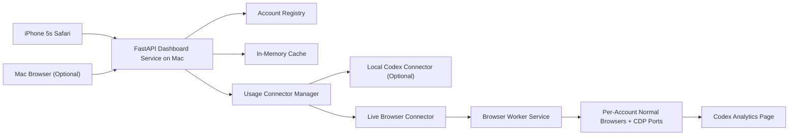
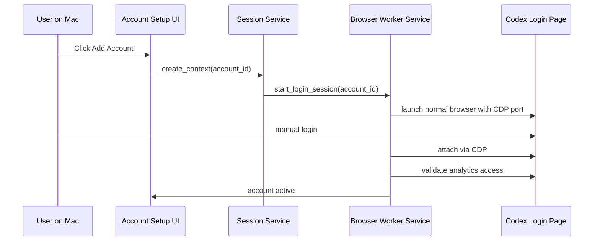
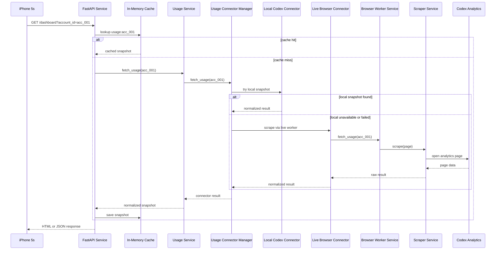

# Token BI 技术架构文档

## 1. 文档目的

本文件用于指导 `Token_BI` 的 MVP 开发实现。

它不是产品需求文档，而是面向开发的技术蓝图，目标是回答以下问题：

- 系统由哪些模块组成
- 每个模块负责什么
- 数据从哪里来，如何流动
- 多账号 session 如何管理
- 页面如何被 `iPhone 5s` 访问
- 出错时系统应该如何表现

本文件默认以 [README.md](/Users/gbs00/我的文件夹/Projects/Token_BI/README.md) 为需求输入，并以其当前确认项为准。

## 2. MVP 范围

### 2.1 目标

实现一个运行在 `Mac` 本地的轻量服务，用于：

- 管理多个 `Codex` 订阅账号的登录态
- 实时抓取所选账号的当前额度数据
- 向 `iPhone 5s` 提供一个局域网可访问的 H5 看板

### 2.2 明确包含

- `Codex` 单 agent 页面
- 多账号切换
- 当前账号脱敏信息展示
- `5 小时额度`
- `周额度`
- `最近更新时间`
- `Open Usage` 外链入口
- 局域网内访问
- 手动启动服务

### 2.3 明确不包含

- 公网访问
- 原生 iOS App
- `7 日用量统计`
- `skills` 统计
- 历史数据持久化
- 自动登录账号
- 存储账号密码

## 3. 技术选型

为减少后续开发分歧，MVP 选型收敛如下：

- 后端服务：`Python 3.11+`
- Web 框架：`FastAPI`
- 模板渲染：`Jinja2`
- 浏览器附着与抓取：`Playwright for Python (CDP attach)`
- 前端形态：`SSR HTML + 少量原生 JavaScript`
- 运行方式：`Mac` 本地进程
- 会话存储：项目目录下本地文件夹
- 缓存策略：进程内内存缓存

选择该组合的原因：

- `FastAPI` 足够轻，适合本地工具型服务
- `Playwright` 在当前方案中只负责通过 `CDP` 附着到普通浏览器并抓取页面
- `SSR` 有利于兼容 `iPhone 5s / iOS 12 Safari`
- 无需数据库即可完成 MVP

## 4. 总体架构



### 4.1 架构解释

- `iPhone 5s` 不运行抓取逻辑，只访问 `Mac` 上提供的网页
- `FastAPI Dashboard Service` 是整个系统中心
- `Account Registry` 保存账号配置元信息
- `Usage Connector Manager` 统一调度多个 usage 数据来源
- `Browser Worker Service` 管理 `Live Browser Connector` 所需的每个账号独立浏览器和 `CDP` 端口
- `In-Memory Cache` 保存短时抓取结果
- `Local Codex Connector` 用于未来接入本机 Codex/CLI 侧快照
- `Codex Analytics Page` 是 MVP 当前主数据来源
- 系统不再把“浏览器关闭后仍可复用登录态”作为主前提，而是依赖长驻 worker 保活

## 5. 系统边界

### 5.1 系统内职责

- 管理账号列表
- 维护每个账号的独立长驻浏览器 worker
- 触发实时抓取
- 解析并标准化当前额度数据
- 输出 H5 页面和 JSON API

### 5.2 系统外依赖

- `Codex / ChatGPT` 网页登录态
- `Mac` 网络环境
- `iPhone 5s` Safari
- 同一局域网下的访问能力

### 5.3 非目标

- 不控制用户账号本身
- 不生成或修改 usage 数据
- 不作为长期历史分析平台

## 6. 目录结构建议

建议项目后续按如下目录组织：

```text
Token_BI/
├── README.md
├── TECH_ARCHITECTURE.md
├── app/
│   ├── main.py
│   ├── config.py
│   ├── routes/
│   │   ├── page_routes.py
│   │   └── api_routes.py
│   ├── services/
│   │   ├── account_service.py
│   │   ├── session_service.py
│   │   ├── browser_worker_service.py
│   │   ├── usage_service.py
│   │   ├── usage_connectors.py
│   │   ├── scraper_service.py
│   │   └── cache_service.py
│   ├── models/
│   │   ├── account.py
│   │   └── usage_snapshot.py
│   ├── templates/
│   │   ├── dashboard.html
│   │   └── partials/
│   └── static/
│       ├── css/
│       └── js/
├── runtime/
│   ├── contexts/
│   │   ├── acc_001/
│   │   └── acc_002/
│   ├── cache/
│   └── logs/
└── config/
    └── accounts.json
```

### 6.1 目录说明

- `app/`：业务代码
- `runtime/contexts/`：每个账号的 Playwright context 存储
- `runtime/cache/`：可选，用于非关键运行时临时文件
- `runtime/logs/`：运行日志
- `config/accounts.json`：账号元信息配置

### 6.2 版本管理建议

以下路径不应进入 Git：

- `runtime/contexts/`
- `runtime/cache/`
- `runtime/logs/`
- 含敏感信息的配置文件

## 7. 核心模块设计

## 7.1 Dashboard Service

职责：

- 启动 HTTP 服务
- 注册页面路由和 API 路由
- 输出 HTML 和 JSON
- 作为前端唯一入口

建议入口：

- `app/main.py`

## 7.2 Account Service

职责：

- 读取账号配置
- 新增账号
- 更新账号状态
- 提供账号列表给页面和 API

建议维护字段：

- `account_id`
- `account_alias`
- `masked_email`
- `status`
- `session_storage_path`
- `created_at`
- `last_validated_at`

说明：

- `account_alias` 仅作为兼容字段保留
- MVP 前端统一显示 `masked_email`
- 若创建时未传入 alias，后端默认将其回落为 `masked_email`

## 7.3 Session Service

职责：

- 维护账号到 context 目录的映射
- 创建和检查本地 context 目录
- 为 `Browser Worker Service` 提供路径层支持

约束：

- 一个账号一个独立 context
- 不混用 cookies
- 不共享 storage state

## 7.4 Browser Worker Service

职责：

- 为每个账号启动一个普通浏览器窗口
- 为该浏览器绑定独立 `CDP` 调试端口
- 保持 worker 运行，供后续定时抓取 usage
- 提供会话状态查询与关闭能力

约束：

- 一个账号一个长驻浏览器
- Worker 关闭后，不承诺可仅靠本地文件稳定恢复登录态
- 服务重启后允许重新登录
- 登录浏览器不由 Playwright 直接拉起自动化上下文，避免触发登录风控

## 7.5 Scraper Service

职责：

- 打开目标 analytics 页面
- 读取页面中可用的数据源
- 返回原始抓取结果

抓取优先级固定为：

1. 页面请求返回
2. 页面内脚本对象
3. DOM 文本降级

冲突规则：

- 若请求返回与 DOM 冲突，以请求返回为准

说明：

- `Scraper Service` 只负责 `Web Session Connector` 的底层页面抓取
- `Scraper Service` 既可读取临时上下文，也可直接读取活着的 worker 页面
- 不再承担“选择哪个数据源入口”的总调度职责

## 7.6 Usage Connector Manager

职责：

- 管理多个 usage connector
- 按固定优先级依次尝试可用 connector
- 对 `connector not applicable` 与 `connector failed` 做区分
- 将成功结果回传给 `Usage Service`

当前 connector 顺序：

1. `Local Codex Connector`
2. `Web Session Connector`

设计原因：

- 参考 `CodexBar` 的多源 fallback 思路
- 避免把“网页抓取”写死成唯一真相源
- 保留未来接入 `CLI / OAuth / 本地探针` 的空间

### 7.5.1 Local Codex Connector

职责：

- 读取本机 Codex 侧标准化 usage 快照
- 如果该账号没有可用本地快照，则跳过

MVP 状态：

- 代码中已预留为增强型 connector
- 当前默认不作为唯一主路径
- 不要求首期必须有生产级数据源接入

### 7.5.2 Web Session Connector

职责：

- 基于账号独立 Playwright context 打开 analytics 页面
- 调用 `Scraper Service` 完成页面抓取
- 在当前 MVP 中作为主路径

## 7.6 Usage Service

职责：

- 调用 `Usage Connector Manager` 获取当前账号 usage
- 将抓取结果转换为统一结构
- 写入短时缓存
- 输出页面或 API 可直接消费的数据

统一返回结构建议：

```json
{
  "account_id": "acc_001",
  "account_alias": "guo****@gmail.com",
  "provider": "codex",
  "source_type": "scraped",
  "source_detail": "network_response",
  "connector_name": "web_session",
  "is_estimated": false,
  "updated_at": "2026-04-21T23:00:00+08:00",
  "session_remaining_pct": 100,
  "session_reset_at": "2026-04-22T03:00:00+08:00",
  "weekly_remaining_pct": 92,
  "weekly_reset_at": "2026-04-28T00:00:00+08:00",
  "usage_detail_url": "https://chatgpt.com/codex/cloud/settings/analytics#usage"
}
```

## 7.7 Cache Service

职责：

- 为账号抓取结果提供短时缓存
- 避免用户切换账号或刷新页面时短时间重复抓取

约束：

- 仅保存在内存
- 不跨进程
- 不跨重启

建议缓存键：

- `usage:acc_001`
- `usage:acc_002`

建议 TTL：

- `30-180 秒`

## 8. 关键数据流

## 8.1 添加账号



关键点：

- 登录由用户手动完成
- 系统负责拉起普通浏览器、附着 CDP 和校验
- 成功后写入账号元信息与 context 路径
- 不再要求浏览器关闭后还能单独复用该登录态

## 8.2 查看看板



## 8.3 切换账号

切换账号的本质是：

`切换请求参数 -> Usage Connector Manager 选择合适 connector -> 若需要则调用对应账号的 live worker -> 返回该账号数据`

不是：

- 重新登录
- 切换手机本地状态
- 切换浏览器 tab

## 9. 页面与 API 设计

MVP 采用：

- 页面路由：给 `iPhone 5s` 直接访问
- API 路由：给页面异步刷新使用

## 9.1 页面路由

### `GET /`

职责：

- 重定向到默认账号看板

### `GET /dashboard`

参数：

- `account_id`

职责：

- 输出 SSR 看板页面

返回内容包括：

- 标题栏
- 账号切换栏
- 额度卡片
- 最近更新时间
- `Open Usage`

## 9.2 API 路由

### `GET /api/v1/accounts`

返回账号列表。

示例：

```json
{
  "items": [
    {
      "account_id": "acc_001",
      "account_alias": "guo****@gmail.com",
      "status": "active"
    }
  ]
}
```

### `GET /api/v1/dashboard`

参数：

- `account_id`

返回单账号当前额度数据。

### `POST /api/v1/accounts`

职责：

- 创建新账号配置
- 初始化 context 目录
- 返回引导用户启动 live worker 的信息

### `POST /api/v1/accounts/{account_id}/validate`

职责：

- 校验登录后的 analytics 是否可访问
- 更新账号状态

### `GET /api/v1/accounts/{account_id}/session`

职责：

- 返回该账号对应的 live worker 状态
- 供后端和调试工具确认 worker 是否仍存活

### `POST /api/v1/accounts/{account_id}/reauth`

职责：

- 重新拉起该账号的 live browser worker
- 让用户在 `Mac` 上重新登录

## 10. 配置文件设计

建议采用 `config/accounts.json` 保存账号元信息。

示例：

```json
{
  "accounts": [
    {
      "account_id": "acc_001",
      "account_alias": "主账号",
      "masked_email": "guo****@gmail.com",
      "status": "active",
      "session_storage_path": "/Users/gbs00/我的文件夹/Projects/Token_BI/runtime/contexts/acc_001",
      "created_at": "2026-04-21T23:00:00+08:00",
      "last_validated_at": "2026-04-21T23:10:00+08:00"
    }
  ]
}
```

约束：

- 文件仅保存元信息
- 不保存明文密码
- 敏感 session 数据只在 `runtime/contexts/` 中

## 11. 运行态设计

## 11.1 Session 存储

路径：

- `/Users/gbs00/我的文件夹/Projects/Token_BI/runtime/contexts/`

规则：

- 每个账号一个目录
- 目录名与 `account_id` 一致
- context 目录由 Playwright 管理

## 11.2 缓存

范围：

- 只保存上次成功抓取结果
- 只存在内存中

用途：

- 减少短时间重复抓取
- 失败时提供回退展示

## 11.3 日志

建议日志记录：

- 账号校验成功/失败
- 抓取成功/失败
- 页面解析失败
- context 失效
- 服务启动和停止

建议目录：

- `/Users/gbs00/我的文件夹/Projects/Token_BI/runtime/logs/`

## 12. 失败与降级设计

## 12.1 降级规则

统一规则：

`优先当前结果 -> 回退上次成功结果 -> 无结果则错误态`

## 12.2 错误分类

建议定义以下错误码：

- `ACCOUNT_NOT_FOUND`
- `SESSION_EXPIRED`
- `SCRAPE_FAILED`
- `ANALYTICS_PAGE_CHANGED`
- `MAC_SERVICE_UNREACHABLE`
- `NO_SUCCESSFUL_SNAPSHOT`

## 12.3 页面状态

页面至少支持以下状态：

- `loading`
- `ready`
- `stale`
- `error`
- `reauth_required`

## 12.4 页面提示文案

建议直接复用需求文档中已确认的英文文案：

- `Updated just now`
- `Showing last successful update`
- `Data may be delayed`
- `Session expired on Mac`
- `Please sign in again on Mac`
- `Cannot reach Mac dashboard service`
- `Check Wi-Fi and make sure Mac is online`
- `No usage data yet`
- `Open Codex on Mac and complete first sync`
- `Unable to read Codex usage right now`
- `Analytics page may have changed`

## 13. 安全约束

## 13.1 已确认约束

- 不保存账号密码
- 不持久化 usage 历史
- 首期不加额外访问口令
- 仅支持同一局域网访问

## 13.2 开发注意事项

- 避免将 session 目录提交到 Git
- 避免在日志中打印完整 cookie
- 避免在 API 返回中暴露敏感字段
- 所有账号展示信息默认脱敏

## 13.3 后续待办

- 增加轻口令或单用户登录保护
- 增加 session 目录的加密策略
- 增加本地服务自启动方案

## 14. 启动与访问模型

## 14.1 启动方式

MVP 采用手动启动：

1. 用户在 `Mac` 上启动服务
2. 服务开始监听局域网地址
3. 用户使用 `iPhone 5s` 打开局域网地址

只要用户不关闭服务，它就持续运行。

## 14.2 访问方式

示例地址：

- `http://192.168.1.23:8787`
- `http://codex-bi.local:8787`

说明：

- 不需要数据线
- 不需要将网页安装到手机
- 实际运行位置仍在 `Mac`

## 15. 开发顺序建议

建议按以下顺序开发：

1. 搭建 `FastAPI` 服务和基础页面
2. 实现账号配置模型和 `accounts.json`
3. 实现 `Browser Worker Service`
4. 接入 `Playwright` 并完成单账号手动登录
5. 实现 analytics 页面抓取与字段解析
6. 实现单账号看板页面
7. 接入多账号切换
8. 实现内存缓存与错误态
9. 优化 `iPhone 5s` 页面样式

## 16. 实现完成标准

达到以下条件可视为 MVP 技术完成：

- 能在 `Mac` 上添加至少 1 个 `Codex` 账号
- 登录成功后能启动独立 live worker 并保持会话可用
- `iPhone 5s` 可通过同一 WiFi 访问看板
- 页面可显示 `5 小时额度` 与 `周额度`
- 页面支持多账号切换
- 登录态失效时可正确提示重新登录
- 抓取失败时可进入 `stale` 或 `error` 状态

## 17. 与 README 的关系

- `README.md`：产品与需求约束
- `TECH_ARCHITECTURE.md`：开发实现蓝图

后续开发过程中，若两者冲突：

1. 先确认是否属于需求变更
2. 若是需求变更，先更新 `README.md`
3. 再同步更新本技术架构文档
