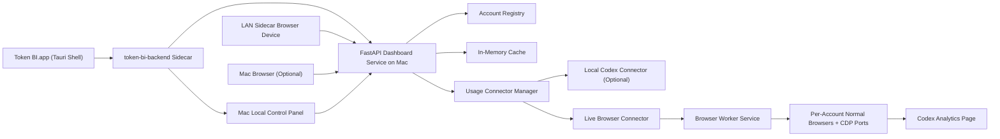
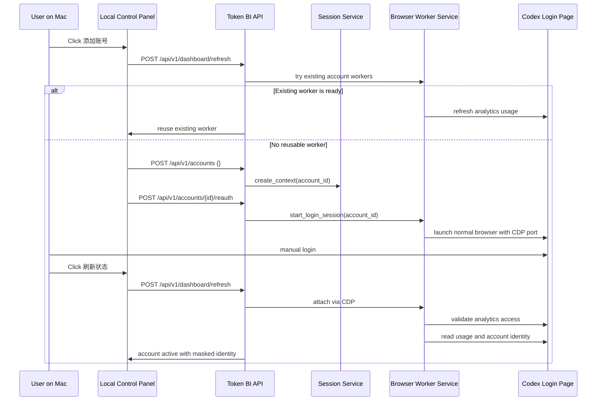
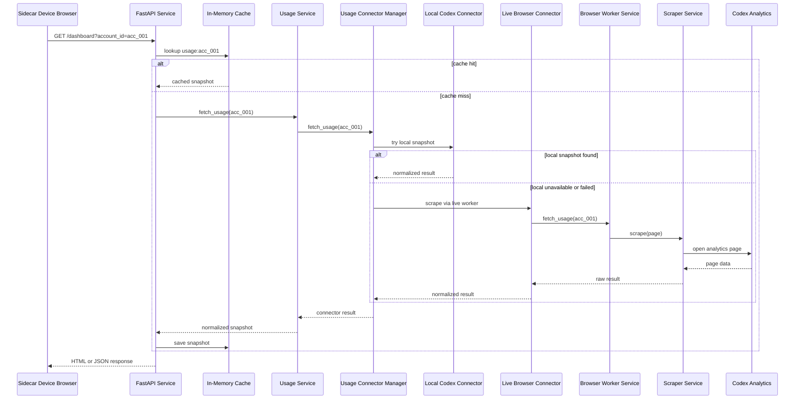

# Token BI 技术架构文档

## 1. 文档目的

本文件用于指导 `Token_BI` 的 MVP 开发实现。

它不是产品需求文档，而是面向开发的技术蓝图，目标是回答以下问题：

- 系统由哪些模块组成
- 每个模块负责什么
- 数据从哪里来，如何流动
- 多账号 session 如何管理
- 页面如何被同局域网副屏设备访问
- 出错时系统应该如何表现

本文件默认以 [README.md](/Users/gbs00/我的文件夹/Projects/Token_BI/README.md) 为需求输入，并以其当前确认项为准。
版本变化参考 [CHANGELOG.md](/Users/gbs00/我的文件夹/Projects/Token_BI/CHANGELOG.md)。

## 2. MVP 范围

### 2.1 目标

实现一个运行在 `Mac` 本地的轻量服务，用于：

- 管理多个 `Codex` 订阅账号的登录态
- 实时抓取所选账号的当前额度数据
- 向任意同局域网副屏设备提供一个可访问的 H5 看板

### 2.2 明确包含

- `Codex` 单 agent 页面
- 多账号切换
- 当前账号脱敏信息展示
- `5 小时额度`
- `周额度`
- `最近更新时间`
- `Open Usage` 外链入口
- 局域网内访问
- Mac 本地控制台启动/停止服务
- `Token BI.app` Mac 桌面壳层
- 固定 `.local` 看板入口
- iPhone / Android 主屏幕或快捷方式访问模式

### 2.3 明确不包含

- 公网访问
- 原生 iOS / Android App
- `7 日用量统计`
- `skills` 统计
- 历史数据持久化
- 自动登录账号
- 存储账号密码

## 3. 技术选型

为减少后续开发分歧，MVP 选型收敛如下：

- 后端服务：`Python 3.11+`
- Web 框架：`FastAPI`
- 模板渲染：`Jinja2`
- 浏览器附着与抓取：`Playwright for Python (CDP attach)`
- 前端形态：`SSR HTML + 少量原生 JavaScript`
- 运行方式：`Mac` 本地进程
- Mac App 壳层：`Tauri 2`
- App 后端封装：`PyInstaller sidecar`
- 本地控制台：独立 `ThreadingHTTPServer`，仅监听 `127.0.0.1`
- 会话存储：`~/Library/Application Support/Token BI/runtime/contexts`
- 缓存策略：进程内内存缓存

选择该组合的原因：

- `FastAPI` 足够轻，适合本地工具型服务
- `Playwright` 在当前方案中只负责通过 `CDP` 附着到普通浏览器并抓取页面
- `SSR` 有利于兼容旧设备浏览器，首期以 `iPhone 5s / iOS 12 Safari` 作为下限基准
- `Tauri` 作为 Mac 本地控制台壳层和 sidecar supervisor，不改变副屏访问方式
- `PyInstaller` 将 Python 后端打包为 App 内部 sidecar，降低普通用户安装门槛
- 无需数据库即可完成 MVP

## 4. 总体架构



### 4.1 架构解释

- 副屏设备不运行抓取逻辑，只访问 `Mac` 上提供的网页
- `FastAPI Dashboard Service` 是整个系统中心
- `Token BI.app` 是推荐的 Mac 端入口，负责拉起控制台并在退出时释放本项目运行资源
- `token-bi-backend` sidecar 提供控制台、主服务、迁移和健康检查 CLI
- `Mac Local Control Panel` 只用于本机启动/停止主服务、查看状态、打开看板，不暴露到局域网
- `Account Registry` 保存账号配置元信息
- `Usage Connector Manager` 统一调度多个 usage 数据来源
- `Browser Worker Service` 管理 `Live Browser Connector` 所需的每个账号独立浏览器和 `CDP` 端口
- `In-Memory Cache` 保存短时抓取结果
- `Local Codex Connector` 用于未来接入本机 Codex/CLI 侧快照
- `Codex Analytics Page` 是 MVP 当前主数据来源
- 系统不再把“浏览器关闭后仍可复用登录态”作为主前提，而是依赖长驻 worker 保活
- 服务重启后会尝试恢复现存 worker；若不存在，则为 `active` 账号拉起新的 worker

## 5. 系统边界

### 5.1 系统内职责

- 管理账号列表
- 维护每个账号的独立长驻浏览器 worker
- 触发实时抓取
- 解析并标准化当前额度数据
- 输出 H5 页面和 JSON API

### 5.2 系统外依赖

- `Codex / ChatGPT` 网页登录态
- `Mac` 网络环境
- iPhone / Android / 平板 / 旧电脑等副屏设备浏览器
- 同一局域网下的访问能力

### 5.3 非目标

- 不控制用户账号本身
- 不生成或修改 usage 数据
- 不作为长期历史分析平台

## 6. 目录结构建议

建议项目后续按如下目录组织：

```text
Token_BI/
├── README.md
├── TECH_ARCHITECTURE.md
├── app/
│   ├── main.py
│   ├── config.py
│   ├── routes/
│   │   ├── page_routes.py
│   │   └── api_routes.py
│   ├── services/
│   │   ├── account_service.py
│   │   ├── session_service.py
│   │   ├── browser_worker_service.py
│   │   ├── usage_service.py
│   │   ├── usage_connectors.py
│   │   ├── scraper_service.py
│   │   └── cache_service.py
│   ├── models/
│   │   ├── account.py
│   │   └── usage_snapshot.py
│   ├── templates/
│   │   ├── dashboard.html
│   │   └── partials/
│   └── static/
│       ├── css/
│       ├── js/
│       └── site.webmanifest
├── scripts/
│   ├── start_server.sh
│   ├── stop_server.sh
│   ├── start_control_panel.sh
│   ├── stop_control_panel.sh
│   ├── stop_app_services.sh
│   ├── control_panel.py
│   ├── open_control_panel.sh
│   └── open_control_panel.command
├── desktop/
│   └── index.html
├── src-tauri/
│   ├── Cargo.toml
│   ├── tauri.conf.json
│   ├── icons/
│   └── src/
├── runtime/
│   ├── contexts/
│   │   ├── acc_001/
│   │   └── acc_002/
│   ├── cache/
│   └── logs/
└── config/
    └── accounts.json
```

### 6.1 目录说明

- `app/`：业务代码
- `runtime/contexts/`：每个账号的 Playwright context 存储
- `runtime/cache/`：可选，用于非关键运行时临时文件
- `runtime/logs/`：运行日志
- `config/accounts.json`：账号元信息配置
- `scripts/start_server.sh`：启动主看板服务
- `scripts/stop_server.sh`：停止主看板服务
- `scripts/start_control_panel.sh`：启动控制台但不打开系统浏览器，供 `Token BI.app` 调用
- `scripts/stop_control_panel.sh`：停止控制台服务
- `scripts/stop_app_services.sh`：App 退出时停止控制台、主服务和 Token BI 管理的 Chrome worker
- `scripts/control_panel.py`：Mac 本地控制台服务
- `scripts/open_control_panel.command`：双击打开控制台
- `src-tauri/`：`Token BI.app` Tauri 壳层工程
- `src-tauri/icons/icon.png`：App icon 源图
- `src-tauri/icons/icon.icns`：macOS App bundle 图标
- `desktop/`：App 窗口初始化页
- `app/static/site.webmanifest`：主屏幕 standalone 元信息

### 6.2 版本管理建议

以下路径不应进入 Git：

- `runtime/contexts/`
- `runtime/cache/`
- `runtime/logs/`
- `node_modules/`
- `src-tauri/target/`
- 含敏感信息的配置文件

## 7. 核心模块设计

## 7.1 Dashboard Service

职责：

- 启动 HTTP 服务
- 注册页面路由和 API 路由
- 输出 HTML 和 JSON
- 作为前端唯一入口

建议入口：

- `app/main.py`

## 7.1.1 Local Control Panel

职责：

- 仅在 Mac 本机提供控制页面
- 显示 Token BI 主服务运行状态、PID、账号摘要、固定入口、局域网入口和日志尾部
- 提供启动主服务、停止主服务、添加账号、打开看板、扫码连接副屏、刷新状态按钮

实现约束：

- 默认监听 `127.0.0.1:8790`
- 不对局域网开放
- 产品化 App 内通过 `token-bi-backend main-server` 管理主服务
- 开发目录仍保留 `scripts/open_control_panel.command` 作为备用入口

## 7.1.1.1 Token BI.app

职责：

- 作为 Mac 用户的推荐启动入口
- 启动并嵌入本地控制台 `http://127.0.0.1:8790/`
- 关闭 App 时通过 `/api/app/shutdown` 停止控制台、停止 `8787` 主看板服务，并清理 Token BI 管理的 Chrome worker
- 提供与项目视觉一致的 App icon 和桌面控制台体验

实现约束：

- 使用 `Tauri 2`
- 使用 `tauri-plugin-shell` 拉起 App 内部 `token-bi-backend` sidecar
- App 窗口加载控制台页面，不额外暴露公网能力
- 不改变主看板 API、账号配置 schema 或副屏访问 URL
- App 退出是“释放本项目运行资源”的强语义；若用户希望保留后台服务，应使用备用脚本方式而不是 App 入口
- 当前 App 已可生成 unsigned DMG；正式分发仍需 Developer ID 签名、notarization 和 GitHub updater manifest

## 7.1.1.2 控制台视觉与交互

控制台页面由 `scripts/control_panel.py` 内嵌 HTML/CSS/JS 输出。

当前视觉方向：

- 深色桌面 App 风格
- 顶部大标题与说明
- 服务状态和当前账号双状态卡
- 主操作按钮组：启动、停止、添加账号、打开看板、扫码连接副屏、刷新状态
- 入口列表：固定入口、局域网入口、本机入口
- 每个入口提供复制与打开按钮
- 扫码连接弹窗：展示固定 `.local` 看板二维码，并提供局域网 IP 二维码作为备用
- 运行日志面板与清空日志按钮
- 底部状态栏显示本地服务状态、端口与模式

## 7.1.2 固定入口

副屏设备优先使用 Bonjour 主机名：

`http://gbs00MacBook-Air-M2.local:8787/dashboard`

说明：

- `/` 固定重定向到 `/dashboard`
- 单账号场景下无需在 URL 中携带 `account_id`
- 当局域网 IP 变化时，`.local` 地址仍应保持稳定
- 控制台可为固定入口生成二维码，便于手机、平板、旧电脑等副屏设备快速接入
- 当副屏设备不支持 `.local` 解析时，控制台提供局域网 IP 二维码作为备用入口

## 7.2 Account Service

职责：

- 读取账号配置
- 新增账号
- 更新账号状态
- 提供账号列表给页面和 API

建议维护字段：

- `account_id`
- `account_alias`
- `masked_email`
- `status`
- `session_storage_path`
- `created_at`
- `last_validated_at`

说明：

- `account_alias` 仅作为兼容字段保留
- MVP 前端统一显示 `masked_email`
- 若创建时未传入 alias，后端默认将其回落为 `masked_email`

## 7.3 Session Service

职责：

- 维护账号到 context 目录的映射
- 创建和检查本地 context 目录
- 为 `Browser Worker Service` 提供路径层支持

约束：

- 一个账号一个独立 context
- 不混用 cookies
- 不共享 storage state

## 7.4 Browser Worker Service

职责：

- 为每个账号启动一个普通浏览器窗口
- 为该浏览器绑定独立 `CDP` 调试端口
- 保持 worker 运行，供后续定时抓取 usage
- 提供会话状态查询与关闭能力

约束：

- 一个账号一个长驻浏览器
- Worker 关闭后，不承诺可仅靠本地文件稳定恢复登录态
- 服务重启后允许重新登录
- 登录浏览器不由 Playwright 直接拉起自动化上下文，避免触发登录风控

## 7.5 Scraper Service

职责：

- 打开目标 analytics 页面
- 读取页面中可用的数据源
- 返回原始抓取结果

抓取优先级固定为：

1. 页面请求返回
2. 页面内脚本对象
3. DOM 文本降级

冲突规则：

- 若请求返回与 DOM 冲突，以请求返回为准

说明：

- `Scraper Service` 只负责 `Web Session Connector` 的底层页面抓取
- `Scraper Service` 既可读取临时上下文，也可直接读取活着的 worker 页面
- 不再承担“选择哪个数据源入口”的总调度职责

## 7.6 Usage Connector Manager

职责：

- 管理多个 usage connector
- 按固定优先级依次尝试可用 connector
- 对 `connector not applicable` 与 `connector failed` 做区分
- 将成功结果回传给 `Usage Service`

当前 connector 顺序：

1. `Local Codex Connector`
2. `Web Session Connector`

设计原因：

- 参考 `CodexBar` 的多源 fallback 思路
- 避免把“网页抓取”写死成唯一真相源
- 保留未来接入 `CLI / OAuth / 本地探针` 的空间

### 7.5.1 Local Codex Connector

职责：

- 读取本机 Codex 侧标准化 usage 快照
- 如果该账号没有可用本地快照，则跳过

MVP 状态：

- 代码中已预留为增强型 connector
- 当前默认不作为唯一主路径
- 不要求首期必须有生产级数据源接入

### 7.5.2 Web Session Connector

职责：

- 基于账号独立 Playwright context 打开 analytics 页面
- 调用 `Scraper Service` 完成页面抓取
- 在当前 MVP 中作为主路径

## 7.6 Usage Service

职责：

- 调用 `Usage Connector Manager` 获取当前账号 usage
- 将抓取结果转换为统一结构
- 写入短时缓存
- 输出页面或 API 可直接消费的数据

统一返回结构建议：

```json
{
  "account_id": "acc_001",
  "account_alias": "guo****@gmail.com",
  "provider": "codex",
  "source_type": "scraped",
  "source_detail": "network_response",
  "connector_name": "web_session",
  "is_estimated": false,
  "updated_at": "2026-04-21T23:00:00+08:00",
  "session_remaining_pct": 100,
  "session_reset_at": "2026-04-22T03:00:00+08:00",
  "weekly_remaining_pct": 92,
  "weekly_reset_at": "2026-04-28T00:00:00+08:00",
  "usage_detail_url": "https://chatgpt.com/codex/cloud/settings/analytics#usage"
}
```

## 7.7 Cache Service

职责：

- 为账号抓取结果提供短时缓存
- 避免用户切换账号或刷新页面时短时间重复抓取

约束：

- 仅保存在内存
- 不跨进程
- 不跨重启

建议缓存键：

- `usage:acc_001`
- `usage:acc_002`

建议 TTL：

- `30-180 秒`

## 8. 关键数据流

## 8.1 添加账号



关键点：

- 登录由用户手动完成
- 控制台不要求用户输入邮箱；首次只创建待识别账号
- 控制台会优先复用已能读取 usage 的现有 worker，避免重复打开空白登录窗口
- 系统负责拉起普通浏览器、附着 CDP、校验 usage，并从已登录会话提取账号标识
- 成功后只写入脱敏账号标识、账号元信息与 context 路径
- 不再要求浏览器关闭后还能单独复用该登录态

## 8.2 查看看板



## 8.3 切换账号

切换账号的本质是：

`切换请求参数 -> Usage Connector Manager 选择合适 connector -> 若需要则调用对应账号的 live worker -> 返回该账号数据`

不是：

- 重新登录
- 切换副屏设备本地状态
- 切换浏览器 tab

## 9. 页面与 API 设计

MVP 采用：

- 页面路由：给同局域网副屏设备直接访问
- API 路由：给页面异步刷新使用

## 9.1 页面路由

### `GET /`

职责：

- 固定重定向到 `/dashboard`
- 不拼接 `account_id`，保证副屏快捷入口稳定

### `GET /dashboard`

参数：

- `account_id` 可选

职责：

- 输出 SSR 看板页面

返回内容包括：

- 标题栏
- 账号切换栏
- 额度卡片
- 最近更新时间
- `Open Usage`
- 单账号场景下自动选择可见账号，无需 URL 带账号 ID

## 9.2 API 路由

### `GET /api/v1/accounts`

返回账号列表。

示例：

```json
{
  "items": [
    {
      "account_id": "acc_001",
      "account_alias": "guo****@gmail.com",
      "status": "active"
    }
  ]
}
```

### `GET /api/v1/dashboard`

参数：

- `account_id`

返回单账号当前额度数据。

前端每 `180 秒` 后台请求该接口并原地更新页面，不再整页 `reload`。

### `POST /api/v1/accounts`

职责：

- 创建新账号配置
- 初始化 context 目录
- 返回引导用户启动 live worker 的信息

### `POST /api/v1/accounts/{account_id}/validate`

职责：

- 校验登录后的 analytics 是否可访问
- 更新账号状态

### `GET /api/v1/accounts/{account_id}/session`

职责：

- 返回该账号对应的 live worker 状态
- 供后端和调试工具确认 worker 是否仍存活
- 如果内存中没有该 session，会尝试从现有 Chrome CDP 进程恢复

### `POST /api/v1/accounts/{account_id}/reauth`

职责：

- 重新拉起该账号的 live browser worker
- 让用户在 `Mac` 上重新登录

### `POST /api/v1/dashboard/refresh`

职责：

- 强制刷新当前账号 usage
- 跳过短时缓存
- 主要供调试和手动刷新流程使用

### 本地控制台接口

本地控制台由 `scripts/control_panel.py` 提供，默认监听 `127.0.0.1:8790`。

- `GET /`：输出控制台页面
- `GET /api/status`：返回主服务运行状态、账号摘要、固定入口、局域网入口、日志尾部
- `GET /api/qrcode?kind=fixed|lan|local`：返回对应看板入口的 SVG 二维码，默认 `fixed`
- `POST /api/start`：调用 `scripts/start_server.sh`
- `POST /api/stop`：调用 `scripts/stop_server.sh`
- `POST /api/add-account`：确保主服务运行，创建待识别账号，并拉起 Chrome 登录 worker
- `POST /api/refresh-status`：对现有账号执行一次 dashboard refresh，成功时同步脱敏账号信息和 usage 状态
- `POST /api/open-dashboard`：在 Mac 上打开固定看板入口

## 10. 配置文件设计

建议采用 `config/accounts.json` 保存账号元信息。

示例：

```json
{
  "accounts": [
    {
      "account_id": "acc_001",
      "account_alias": "user****@example.com",
      "masked_email": "user****@example.com",
      "status": "active",
      "session_storage_path": "/Users/gbs00/我的文件夹/Projects/Token_BI/runtime/contexts/acc_001",
      "created_at": "2026-04-21T23:00:00+08:00",
      "last_validated_at": "2026-04-21T23:10:00+08:00"
    }
  ]
}
```

约束：

- 文件仅保存元信息
- 不保存明文密码
- 控制台添加账号时可先写入 `Signing in ...` 占位，验证成功后再替换成自动识别到的脱敏账号标识
- 敏感 session 数据只在 `runtime/contexts/` 中

## 11. 运行态设计

## 11.1 Session 存储

路径：

- `/Users/gbs00/我的文件夹/Projects/Token_BI/runtime/contexts/`

规则：

- 每个账号一个目录
- 目录名与 `account_id` 一致
- context 目录由 Playwright 管理

## 11.2 缓存

范围：

- 只保存上次成功抓取结果
- 只存在内存中

用途：

- 减少短时间重复抓取
- 失败时提供回退展示

## 11.3 日志

建议日志记录：

- 账号校验成功/失败
- 抓取成功/失败
- 页面解析失败
- context 失效
- 服务启动和停止

建议目录：

- `/Users/gbs00/我的文件夹/Projects/Token_BI/runtime/logs/`

## 12. 失败与降级设计

## 12.1 降级规则

统一规则：

`优先当前结果 -> 回退上次成功结果 -> 无结果则错误态`

## 12.2 错误分类

建议定义以下错误码：

- `ACCOUNT_NOT_FOUND`
- `SESSION_EXPIRED`
- `SCRAPE_FAILED`
- `ANALYTICS_PAGE_CHANGED`
- `MAC_SERVICE_UNREACHABLE`
- `NO_SUCCESSFUL_SNAPSHOT`

## 12.3 页面状态

页面至少支持以下状态：

- `loading`
- `ready`
- `stale`
- `error`
- `reauth_required`

## 12.4 页面提示文案

建议直接复用需求文档中已确认的英文文案：

- `Updated just now`
- `Showing last successful update`
- `Data may be delayed`
- `Session expired on Mac`
- `Please sign in again on Mac`
- `Cannot reach Mac dashboard service`
- `Check Wi-Fi and make sure Mac is online`
- `No usage data yet`
- `Open Codex on Mac and complete first sync`
- `Unable to read Codex usage right now`
- `Analytics page may have changed`
- `Connection interrupted. Retrying automatically...`

### 12.5 移动端恢复策略

移动端页面不再定时整页刷新，而是：

1. 保留当前 HTML 与已有额度值
2. 每 `180 秒` 请求 `/api/v1/dashboard`
3. 请求成功时原地更新账号、状态、更新时间、来源、额度百分比、进度条和重置时间
4. 请求失败时显示 `Connection interrupted. Retrying automatically...`
5. 失败后每 `15 秒` 重试一次

这样可以避免服务重启瞬间导致 iOS 主屏幕页面落入系统级“服务器无响应”页。

## 13. 安全约束

## 13.1 已确认约束

- 不保存账号密码
- 不持久化 usage 历史
- 首期不加额外访问口令
- 仅支持同一局域网访问

## 13.2 开发注意事项

- 避免将 session 目录提交到 Git
- 避免在日志中打印完整 cookie
- 避免在 API 返回中暴露敏感字段
- 所有账号展示信息默认脱敏

## 13.3 后续待办

- 增加轻口令或单用户登录保护
- 增加 session 目录的加密策略
- 增加本地服务自启动方案

## 14. 启动与访问模型

## 14.1 启动方式

MVP 当前推荐采用 `Token BI.app` 启动：

1. 用户双击 `Token BI.app`
2. App 自动启动控制台服务 `127.0.0.1:8790`
3. App 窗口内显示控制台
4. 用户点击 `启动 Token BI`
5. 主服务监听 `0.0.0.0:8787`
6. 用户使用任意同局域网副屏设备打开固定 `.local` 地址

控制台本身仅监听 `127.0.0.1`，用于 Mac 本机操作；主看板服务监听局域网地址，供副屏设备访问。

## 14.2 访问方式

示例地址：

- 固定入口：`http://gbs00MacBook-Air-M2.local:8787/dashboard`
- 本机入口：`http://127.0.0.1:8787/dashboard`
- 局域网 IP 入口：`http://192.168.x.x:8787/dashboard`

说明：

- 不需要数据线
- 不需要将网页安装到副屏设备本地
- 实际运行位置仍在 `Mac`
- 推荐用固定 `.local` 地址添加到 iPhone / Android 主屏幕或浏览器快捷方式
- 浏览器是否全屏由设备系统和浏览器决定；若希望减少浏览器栏影响，应优先使用主屏幕/快捷方式启动模式

## 14.3 服务与 worker 生命周期

- `Token BI.app` 退出时，会停止控制台、停止主服务并关闭 Token BI 管理的 Chrome worker
- 备用脚本方式停止主服务时，可只停止 `8787` 主服务
- Token BI 主服务启动时，会扫描 `active` 账号并尝试恢复或拉起对应 worker
- 如果 Chrome worker 仍存在且 CDP 端口可访问，服务会直接接回
- 如果 Chrome worker 不存在，服务会根据账号的 `session_storage_path` 拉起新 worker
- 如果登录态失效，页面进入 `reauth_required` 或 `error` 状态，用户需要在 Mac 上重新登录

## 14.4 额度视觉规则

`remaining_pct` 的视觉分档：

- `> 75%`：亮青色，状态健康
- `> 50% 且 <= 75%`：绿色，状态正常
- `> 25% 且 <= 50%`：黄色，提醒关注
- `<= 25%`：红色，额度紧张

百分比数字应是指标卡内最突出的信息，`left` 作为辅助尾标显示。

## 15. 分发路线

## 15.1 当前状态：项目目录型 App

当前 `Token BI.app` 可以构建为 macOS App bundle，但仍依赖项目目录：

- `.venv`
- `app/`
- `scripts/`
- `config/`
- `runtime/`

因此，它适合：

- 本机日常使用
- 开发预览
- 熟悉命令行和依赖安装的用户

## 15.2 DMG 开发预览版

可以将 App 打成 `.dmg` 并上传 GitHub Releases，但需要在发布说明中明确：

- 用户仍需按 `SETUP.md` 安装 Python、Node、Rust/Cargo、Chrome 和 Python 依赖
- App 需要配合完整项目目录运行
- 第一次打开可能被 Gatekeeper 提示阻止，需要右键打开或在系统设置中允许

## 15.3 普通用户可用版

若要做到普通用户下载后开箱即用，后续需要：

- 将 Python 后端打包为 App 内资源或独立二进制
- 将配置与运行数据从项目目录迁移到 `~/Library/Application Support/Token BI/`
- 不再依赖项目源码路径
- 提供 `.dmg` 安装包
- 增加 Developer ID 签名和 notarization

## 16. 开发顺序建议

建议按以下顺序开发：

1. 搭建 `FastAPI` 服务和基础页面
2. 实现账号配置模型和 `accounts.json`
3. 实现 `Browser Worker Service`
4. 接入 `Playwright` 并完成单账号手动登录
5. 实现 analytics 页面抓取与字段解析
6. 实现单账号看板页面
7. 接入多账号切换
8. 实现内存缓存与错误态
9. 优化 `iPhone 5s` 横屏页面样式，并逐步扩展到更多副屏设备尺寸

## 17. 实现完成标准

达到以下条件可视为 MVP 技术完成：

- 能在 `Mac` 上添加至少 1 个 `Codex` 账号
- 登录成功后能启动独立 live worker 并保持会话可用
- 同局域网副屏设备可通过同一 WiFi / 局域网访问看板
- 页面可显示 `5 小时额度` 与 `周额度`
- 页面支持多账号切换
- 登录态失效时可正确提示重新登录
- 抓取失败时可进入 `stale` 或 `error` 状态

## 18. 与 README 的关系

- `README.md`：产品与需求约束
- `TECH_ARCHITECTURE.md`：开发实现蓝图

后续开发过程中，若两者冲突：

1. 先确认是否属于需求变更
2. 若是需求变更，先更新 `README.md`
3. 再同步更新本技术架构文档
