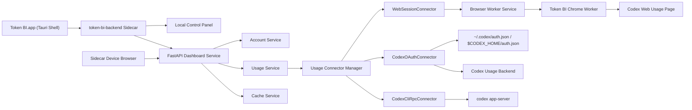
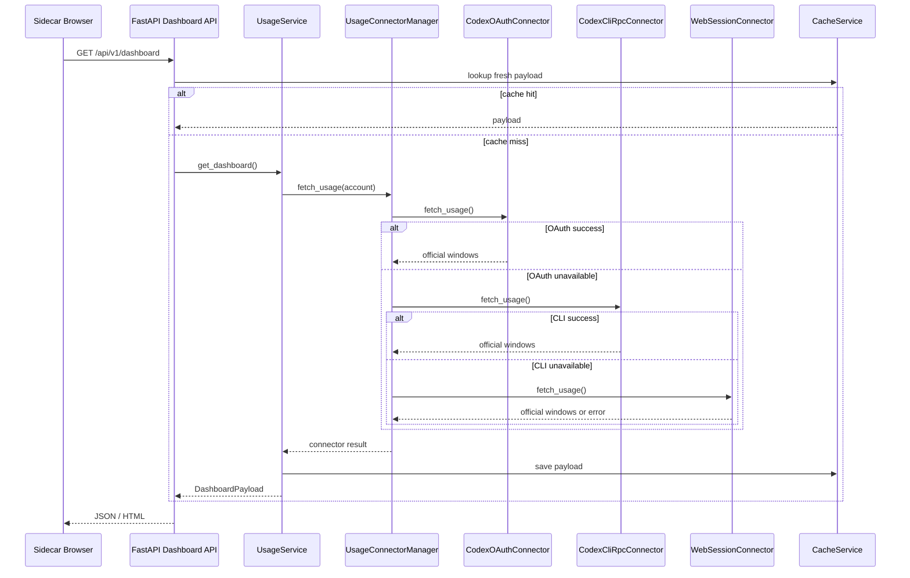
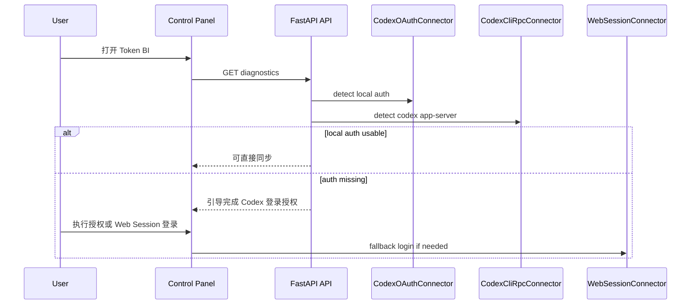

# Token BI V1.0.0 技术架构文档

日期：2026-05-23  
状态：设计草案  
输入来源：`Token BI 需求澄清分析` V1.0 PRD 草案、`V0.9.1 优化点整理`

## 1. 文档目的

本文用于指导 `Token_BI` 从 v0.9.1 可信测试版演进到 v1.0.0。

v1.0.0 的核心变化是：

- 从“浏览器 CDP 抓取主链路”调整为“无感后端数据源优先，浏览器兜底”。
- 从固定解释 `5h` / `weekly` 指标调整为官方 usage / rate limit 窗口透传。
- 常规刷新不应弹出、切换或唤起 Chrome tab。
- 保留现有 Mac 本地服务、副屏 H5 看板、Tauri App 壳层和局域网访问形态。

本文不是发布说明，也不是 UI 设计稿。它回答：

- v1.0.0 的系统边界是什么。
- 数据源如何选择与降级。
- 官方 usage 指标如何进入看板。
- 敏感数据和日志边界是什么。
- 哪些模块需要新增或替换。
- 本地验证应覆盖哪些路径。

## 2. 设计原则

### 2.1 无感优先

- 常规刷新不打开 Chrome，也不切换用户当前桌面焦点。
- Web Session / Chrome worker 只作为兜底，不再作为常规刷新主路径。
- 用户不应为了看额度反复处理登录窗口、usage 页面或 Chrome tab。

### 2.2 官方指标透传与 BI 展示边界

- Token BI 不自建固定指标库。
- Token BI 不把 `primary_window` / `secondary_window` 固定解释为 `session` / `weekly`。
- 后端连接器仍按官方 usage / rate limit 窗口归一化，避免补 0 或伪造指标。
- BI 看板只展示用户明确关心的额度窗口：`5h 额度` 与 `周额度`。
- 官方返回未知窗口时，不进入 BI 看板；后续如需展示，必须先补充需求纪要和展示语义。
- 官方删除窗口时，不展示该窗口，不报错、不补 0。
- `0%` 只代表官方明确返回剩余额度为 0。

### 2.3 标准生态优先

- 优先复用 Codex CLI / Codex App 已有本机登录态。
- 优先通过官方或本机标准能力读取 usage。
- 不新增自研鉴权系统，不存储账号密码。

### 2.4 安全克制

- 不存储 usage 历史。
- 不保存账号密码。
- 不把 token、cookie、邮箱明文、账户标识明文或官方原始响应写入普通日志。
- `raw_window` 只用于内存态排障和适配。

## 3. V1.0.0 范围

### 3.1 P0 必须完成

- 新增 `CodexOAuthConnector` 作为首选数据源。
- 新增 `CodexCliRpcConnector` 作为本机 Codex 能力 fallback。
- 调整 `UsageConnectorManager` 数据源顺序。
- 调整 usage 数据模型为官方窗口透传。
- 调整看板按官方窗口列表渲染指标卡。
- 常规刷新不依赖 Chrome worker。
- 增加 token 过期、未登录、权限不足、官方结构变化的错误态。
- 增加敏感数据与日志边界。

### 3.2 P1 应该完成

- 保留 `WebSessionConnector` 作为主链路不可用时的兜底。
- 控制台展示当前数据源与降级原因。
- 看板失败时保留上次成功数据和错误原因。
- 同步更新 `README.md`、`TECH_ARCHITECTURE.md`、`CHANGELOG.md`。

### 3.3 P2 暂缓

- 多账号复杂切换体验。
- usage 历史分析、趋势图、skills 统计。
- 正式公开分发、签名、公证、自动更新链路。
- 更多副屏设备 UI 深度优化。

## 4. 总体架构



## 5. 数据源策略

### 5.1 数据源优先级

固定顺序：

1. `CodexOAuthConnector`
2. `CodexCliRpcConnector`
3. `WebSessionConnector`
4. `DOM fallback`

说明：

- OAuth usage 后端来自 ChatGPT/Codex 登录态，是当前优先数据源，但不是公开承诺稳定的 OpenAPI。
- `codex app-server` 当前带实验语义，需要封装失败、超时和降级。
- Web Session 仍保留，但只在前两条主链路不可用时触发。
- DOM fallback 只作为最后诊断手段，不作为常规刷新主路径。

### 5.2 CodexOAuthConnector

职责：

- 读取本机 Codex 登录态。
- 自动判断是否存在可用 ChatGPT auth token。
- 请求 Codex usage 后端接口。
- 将官方返回窗口转换为 Token BI 的展示模型。

输入：

- `~/.codex/auth.json`
- `$CODEX_HOME/auth.json`

输出：

- 当前账号标识，优先脱敏。
- 官方 usage / rate limit 窗口列表。
- 数据源元信息。

失败场景：

- auth 文件不存在。
- auth 结构不匹配。
- access token 过期且无法刷新。
- usage 后端返回 401 / 403 / 429 / 5xx。
- usage 返回结构无法解析。

处理规则：

- 不把 token 写入日志。
- 401 / 403：返回 `reauth_required`。
- 429：退避后保留上次成功结果。
- 5xx / 网络错误：退避后降级下一 connector。
- 结构无法解析：返回 `source_changed`，保留上次成功结果。

### 5.3 CodexCliRpcConnector

职责：

- 调用本机 `codex app-server`。
- 读取账号信息和 rate limit 数据。
- 将返回窗口转换为 Token BI 展示模型。

候选能力：

- `account/read`
- `account/rateLimits/read`

约束：

- app-server 属于本机能力 fallback，不要求用户理解 RPC 细节。
- 调用必须有超时，避免看板刷新被阻塞。
- 失败后应继续降级到 `WebSessionConnector`。

失败场景：

- 未安装 `codex`。
- `codex app-server` 不支持目标命令。
- 本机未登录。
- RPC 超时。
- 返回结构变化。

### 5.4 WebSessionConnector

职责：

- 保留现有 Chrome/CDP worker。
- 在 OAuth / CLI 不可用时作为兜底读取路径。
- 帮助无本机登录态用户完成一次 Web 登录。

变化：

- 不再作为常规刷新主路径。
- 触发时控制台必须解释原因。
- 成功后仍可尝试最小化 Token BI 管理的 worker。

### 5.5 DOM fallback

职责：

- 仅在 network / script / API 路径均不可用时尝试解析页面文本。
- 仅用于诊断或短期兼容。

约束：

- 不作为常规刷新主路径。
- 不新增复杂 DOM 语义推断。

## 6. 核心数据模型

### 6.1 OfficialUsageWindow

用于在后端内部承载官方返回窗口。

```json
{
  "raw_window": {},
  "display_name": "Weekly",
  "remaining_pct": 92,
  "reset_at": "2026-05-30T16:00:00+08:00",
  "window_seconds": 604800,
  "window_minutes": 10080,
  "source_type": "oauth",
  "source_detail": "oauth_usage_api"
}
```

字段说明：

- `raw_window`：官方返回的原始窗口数据，只允许在内存态用于排障和适配。
- `display_name`：展示名称，优先使用官方名称；官方未提供时才根据窗口时长生成保守名称。
- `remaining_pct`：剩余百分比，来自官方剩余值，或由官方 `used_percent` 换算。
- `reset_at`：官方返回的重置时间，只做时区转换和倒计时展示。
- `window_seconds` / `window_minutes`：官方返回的窗口时长，仅用于排序和兜底命名，不用于固化业务枚举。
- `source_type`：数据源，如 `oauth` / `cli_rpc` / `web_session` / `dom_fallback`。
- `source_detail`：具体读取路径，如 `oauth_usage_api` / `cli_rate_limits` / `network_response`。

### 6.2 DashboardPayload

建议 v1.0.0 API 返回结构：

```json
{
  "account": {
    "account_id": "acc_current",
    "masked_email": "user****@example.com",
    "status": "active"
  },
  "state": "ready",
  "message": null,
  "summary": {
    "updated_at": "2026-05-23T16:00:00+08:00",
    "source_type": "oauth",
    "source_detail": "oauth_usage_api",
    "connector_name": "codex_oauth",
    "is_estimated": false
  },
  "metrics": [
    {
      "display_name": "Weekly",
      "remaining_pct": 92,
      "reset_at": "2026-05-30T16:00:00+08:00",
      "window_seconds": 604800,
      "source_type": "oauth",
      "source_detail": "oauth_usage_api"
    }
  ],
  "detail_links": [
    {
      "label": "Usage 入口",
      "url": "https://chatgpt.com/codex/cloud/settings/analytics#usage",
      "requires_same_account_login": true
    }
  ]
}
```

兼容策略：

- `metrics` 改为窗口列表，不再要求同时存在 `session_*` 和 `weekly_*`。
- 前端不得依赖固定 `metric_type` 决定展示是否存在。
- 如需兼容旧前端，可短期保留 `metric_type`，但只能作为展示辅助，不作为业务真相。

## 7. 核心模块设计

### 7.1 UsageConnectorManager

职责：

- 统一调度 usage connector。
- 区分 `not_applicable`、`reauth_required`、`rate_limited`、`source_changed` 和普通失败。
- 按优先级依次尝试 connector。
- 记录最终成功的数据源和失败降级原因。

建议接口：

```python
class UsageConnector:
    name: str
    source_type: str

    def fetch_usage(self, account: AccountRecord) -> UsageConnectorResult:
        ...
```

`UsageConnectorResult` 建议包含：

- `connector_name`
- `source_type`
- `source_detail`
- `account_identity`
- `windows`
- `raw_debug_summary`

### 7.2 UsageService

职责：

- 选择当前账号。
- 调用 `UsageConnectorManager`。
- 将官方窗口转换为 `DashboardPayload`。
- 写入短时缓存。
- 失败时返回 stale 数据或明确错误。

变化：

- 不再在这里构造固定 `5h Session` / `Weekly` 两张卡。
- 不再把缺少 session 视为异常。
- 不再按 `primary_window` / `secondary_window` 推断业务枚举。

### 7.3 CacheService

职责：

- 保存最近一次成功的 `DashboardPayload`。
- 为失败时 stale 展示提供数据。
- 避免短时间重复读取主链路。

建议：

- 成功结果 TTL：90 秒。
- stale 结果可保留到进程生命周期结束。
- 不跨进程持久化 usage 历史。

### 7.4 AccountService

职责：

- 管理 Token BI 内部账号记录。
- 保存脱敏身份、状态和最后校验时间。
- 不保存账号密码。
- 不保存 token 明文。

v1.0.0 变化：

- 支持“本机 Codex 登录态可用，但 Token BI 尚无账号记录”的首次识别流程。
- OAuth / CLI 成功读取账号身份后，自动创建或更新当前账号记录。

### 7.5 Control Panel

职责：

- 展示主服务状态。
- 展示当前账号。
- 展示数据源状态。
- 展示主链路失败和降级原因。
- 提供登录授权、同步 usage、扫码连接副屏。

v1.0.0 新增状态：

- `oauth_ready`
- `cli_rpc_ready`
- `web_session_fallback`
- `reauth_required`
- `rate_limited`
- `source_changed`

### 7.6 BrowserWorkerService

职责：

- 继续管理 Web Session 兜底所需的 Chrome worker。
- 关闭账号时释放 Token BI 管理的 worker。

v1.0.0 变化：

- 启动主服务时不应默认拉起 Chrome worker。
- 只有进入 Web Session 兜底时才启动或恢复 worker。
- 成功读取后可尝试最小化 worker。

### 7.7 Dashboard Frontend

职责：

- 渲染账号信息。
- 渲染 `5h 额度` 与 `周额度`。
- 展示数据源和下次同步倒计时。
- 定时刷新和手动同步。

变化：

- 根据 `metrics[]` 动态渲染已识别额度卡片。
- 周额度与 5h 额度同等优先级，使用同规格卡片。
- 百分比只在圆环中心显示一次。
- 卡片底部只显示后端重置剩余时间。
- 未知指标、链路、日志、刷新间隔和服务状态不在 BI 看板展示。
- 官方删除窗口时自动消失，不展示空卡、不补 0。

## 8. 数据流

### 8.1 常规刷新



### 8.2 首次授权



## 9. 刷新与退避

### 9.1 成功刷新

- 默认刷新间隔：180 秒。
- 手动同步：绕过短时缓存。
- 成功后更新 `updated_at`、`source_type`、`source_detail`。

### 9.2 失败退避

- 网络错误：保留上次成功结果，15 秒后重试一次；连续失败后回到 60 秒间隔。
- 429：保留上次成功结果，至少退避 20 秒。
- 5xx / 超时：退避 2 秒后最多重试一次，再降级或返回 stale。
- 401 / 403：进入 `reauth_required`。
- 官方结构变化：进入 `source_changed`，保留上次成功结果。

## 10. API 设计

### 10.1 `GET /api/v1/dashboard`

返回当前账号看板 payload。

参数：

- `account_id` 可选。

行为：

- 优先返回短时缓存。
- 缓存未命中时按 connector 优先级读取。
- 失败时返回 stale 或错误状态。

### 10.2 `POST /api/v1/dashboard/refresh`

手动同步 usage。

行为：

- 清理当前账号短时缓存。
- 强制读取主链路。
- 失败时按退避和 stale 规则返回。

### 10.3 `GET /api/v1/diagnostics`

返回控制台诊断信息。

新增诊断项：

- `codex_auth_available`
- `codex_cli_available`
- `oauth_connector_ready`
- `cli_rpc_connector_ready`
- `web_session_available`
- `last_connector_error`

### 10.4 `POST /api/v1/account-session/login`

保留现有接口，但语义调整：

- 优先引导本机 Codex 授权。
- 只有主链路不可用时才进入 Web Session 登录。

### 10.5 `POST /api/v1/account-session/logout`

行为：

- 删除 Token BI 内账号记录。
- 清理 Token BI 侧缓存。
- 关闭 Token BI 管理的 Web Session worker。
- 不删除用户日常 Codex CLI 登录态，除非后续单独提供明确操作。

## 11. 敏感数据与日志

### 11.1 禁止写入普通日志

- access token
- refresh token
- cookie
- 邮箱明文
- 账户 ID 明文
- 官方完整 usage 原始响应
- `raw_window` 完整内容

### 11.2 允许写入日志

- connector 名称。
- source_type / source_detail。
- 字段名摘要。
- HTTP 状态码。
- 错误类型。
- 脱敏账号标识。

### 11.3 raw_window 使用边界

- 仅用于内存态排障、解析适配和必要调试。
- 不长期落库。
- 不跨进程保存。
- 如需导出问题样本，必须先脱敏并由用户明确确认。

## 12. 本地验证计划

### 12.1 单元测试

- OAuth auth 文件不存在时跳过到下一 connector。
- OAuth token 过期时返回 `reauth_required`。
- OAuth 返回单窗口时只生成一个 metric。
- CLI RPC 不存在时跳过到 Web Session。
- Web Session 仅在主链路不可用时触发。
- 官方新增未知窗口时可渲染。
- 官方返回 0 时显示 0。
- 未返回窗口时不补 0。
- 日志脱敏测试。

### 12.2 API 测试

- `GET /api/v1/dashboard` 返回动态 `metrics[]`。
- `POST /api/v1/dashboard/refresh` 绕过缓存。
- `GET /api/v1/diagnostics` 返回 OAuth / CLI / Web Session 状态。
- 结构变化时返回 stale + 错误信息。

### 12.3 前端测试

- 单窗口指标卡渲染。
- 多窗口指标卡渲染。
- 未知窗口名称兜底展示。
- 数据源标签展示。
- 错误态和 stale 态展示。
- iPhone 5s 横屏布局不溢出。

### 12.4 本地集成验收

- 已登录 Codex CLI：不打开 Chrome 即可刷新。
- 未登录 Codex CLI：控制台展示授权引导。
- OAuth 失败但 Web Session 可用：自动降级并说明原因。
- 断网：保留上次成功结果。
- 429：退避，不连续猛刷。

## 13. 迁移策略

### 13.1 代码迁移

- 新增 OAuth / CLI connector，不删除 Web Session connector。
- 调整 connector 优先级。
- 调整 payload 模型和前端动态渲染。
- 删除对固定 `session_*` / `weekly_*` 的强依赖。

### 13.2 数据迁移

- 无 usage 历史数据迁移。
- 账号记录可沿用现有 `accounts.json`。
- Web Session profile 保留为兜底能力。

### 13.3 用户迁移

- 已有用户升级后优先尝试本机 Codex 登录态。
- 若未发现本机登录态，控制台引导完成一次 Codex 授权。
- 原有 Web Session 登录能力保留为 fallback。

结论：无历史 usage 迁移，直接替换刷新主链路。

## 14. 交付检查清单

- [x] 技术架构文档与 PRD 一致。
- [x] `README.md` 更新 1.0.0 数据源方向。
- [x] `TECH_ARCHITECTURE.md` 指向本版本文档。
- [x] `CHANGELOG.md` 增加 v1.0.0 设计项。
- [x] OAuth connector 单元测试通过。
- [x] OAuth connector 本机 auth usage endpoint 探测通过。
- [x] CLI RPC connector 单元测试通过。
- [x] CLI RPC connector 本机 app-server 字段探测通过。
- [x] Web Session fallback 测试通过。
- [x] Dashboard 动态窗口渲染测试通过。
- [x] 控制台展示数据源链路与刷新后 connector 来源。
- [x] `raw_window` / token 不进入 DashboardPayload 输出测试通过。
- [x] connector 降级诊断错误脱敏测试通过。
- [x] 本地临时集成验收不调用 BrowserWorker 完成 CLI RPC 常规刷新。
