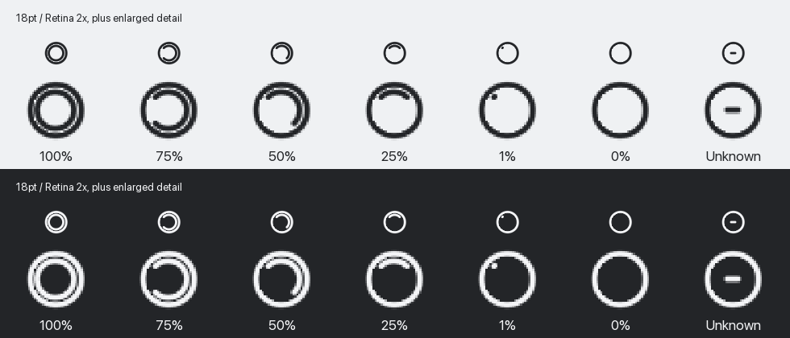

# 菜单栏动态额度内环

2026-09-25：本功能已纳入 v1.2.6 候选包，与 WKWebView 改造一起验证；[当前交付状态](releases/v1.2.6-verification.md)。下文保留最初本地 1.2.5 构建的历史记录。

日期：2026-09-24。状态：本地验收构建，尚未提交、推送或发布。版本字段仍为 1.2.5，但与已发布的静态图标版构建不同。

## 确认规则

- 有有效 5h 额度时优先显示 5h；没有有效 5h 时使用周额度，不取两者最小值。
- 0% 是有效值，不因值为零而降级到周额度。缺失值、非数字与未知窗口不补成 0%。窗口时长优先于旧的类型名称。
- 内环显示剩余比例，100% 为完整内环，0% 内环消失；外环保留已验收模板。部分圆弧从左上方向起，按顺时针方向覆盖剩余比例。
- 无有效账号/额度、已退出账号、本机服务不可用时显示中心短横线，与 0% 区分。
- 同账号的陈旧缓存保持最后成功比例，悬停提示为“上次同步值，等待更新”；不按时间推算剩余额度，不自动填满已到重置时间的窗口。
- 存储重置次数与到期时间不参与内环比例。

## 实现边界

- 新增 `src-tauri/src/menubar/quota_icon.rs`，独立负责取值、内环绘制、原生模板更新与旧响应淘汰；不改后台额度获取优先级或同步调度。
- 面板展开时，从现有 `panel_action(status)` 返回的同一份结果更新内环；手动刷新后沿用页面的重新读取结果，不额外调用官方同步。
- 面板隐藏时，每约 3 秒读取本机 `/api/status` 缓存，正常响应下新同步值最多约一个轮询周期后反映到图标；这不是新增官方额度请求，也不是服务器推送。请求有 6 秒超时、不使用代理、不跟随重定向。面板可见时暂停后台轮询，先前已发出的请求通过序号淘汰，避免覆盖前台新结果。
- 状态变化才更新 tooltip，比例变化才生成 36px RGBA 图标。保持 18pt 菜单栏占位，单色模板由 AppKit 着色，没有新增定时动画、进程或生产依赖。
- 使用锁定的 tray-icon 0.21.3 的 `set_icon_with_as_template` 原子替换图像和模板标记，避免单独 `set_icon` 清除模板属性导致深色模式图标变黑。
- 使用请求序号拒绝过期响应；登录/退出成功、服务重新启动时立即清空旧内环，防止之前的请求恢复旧数据。
- 非 macOS 图标、彩色应用图标、原生点击菜单、面板布局、扫码和副屏功能保持不变。

## 视觉与测试



上图直接使用 Rust 生产绘制函数的 RGBA 输出，包含 100/75/50/25/1/0/未知状态。小图为 36px Retina 2× 图像，大图用于检查像素；它不是运行中的系统菜单栏截图。

- Rust 28 项测试通过，另有显式视觉导出测试手动通过。覆盖 5h 优先、周额度兜底、零值、无效值、窗口时长、缓存、账号失效、请求乱序、外环像素保持与圆弧方向。
- JavaScript 13 项通过；Python/浏览器相关回归 125 项通过，范围为桌面面板、存储重置、控制台状态与 API 路由。没有将此次结果表述为完整后端套件通过。
- `cargo fmt --check`、Clippy `--all-targets -- -D warnings` 与差异检查通过。
- 本机只读 `/api/status` 连续 10 次抽样，中位约 4.3ms，最大约 52.5ms。仅说明本机缓存接口的当次耗时，不代表耗电、跨设备或整体性能基准。
- 未重新测试真实网页登录、所有系统外观、菜单栏高亮、多屏或睡眠恢复；真实菜单栏比例观感仍待用户验收。

## 本机安装

- 仅重建 App，复用未变化的 1.2.5 control/backend，未生成或覆盖新的 GitHub DMG、Updater 归档、签名或发布清单。
- App 体积 184,569,474 字节，运行库链接与包体预算验证通过。隔离验证控制/主服务、暂停账号读取、看板、静态资源、二维码和退出释放端口通过。
- 正常退出旧 App 后直接覆盖 `/Applications/Token BI.app`，按用户要求未新增旧版备份；账号、设置、浏览器数据保持原样。
- 构建及安装后的深度签名验证通过；516 个文件及 8 个符号链接与构建包逐项一致。
- 已安装主程序 SHA-256：`5bf207d2af77c8d4033f40d0d66e47fde8814b487630ff039b98c1f1113ac222`。
- 重启后仅一套 shell/control/backend，控制服务和主服务健康；原生面板显示同一脱敏账号、OAuth、周额度与存储重置，和本机接口一致。没有修改真实额度或消耗存储重置来测试。
- 本地版本号仍显示 1.2.5。GitHub 的正式 1.2.5、标签和更新清单不变，本轮不推送。

## 复现预览

先导出实际生产渲染，再用带 Pillow 的开发环境生成离屏对照。Pillow 仅用于此 QA 脚本，不加入 App 依赖或安装包。

```sh
TOKEN_BI_ICON_QA_DIR="$PWD/dist/quota-icon-qa.noindex" cargo test --manifest-path src-tauri/Cargo.toml --target-dir src-tauri/target.noindex export_quota_icon_preview_when_requested -- --ignored
python3 scripts/preview_quota_icon.py dist/quota-icon-qa.noindex docs/design-previews/quota-icon-comparison.png
```
